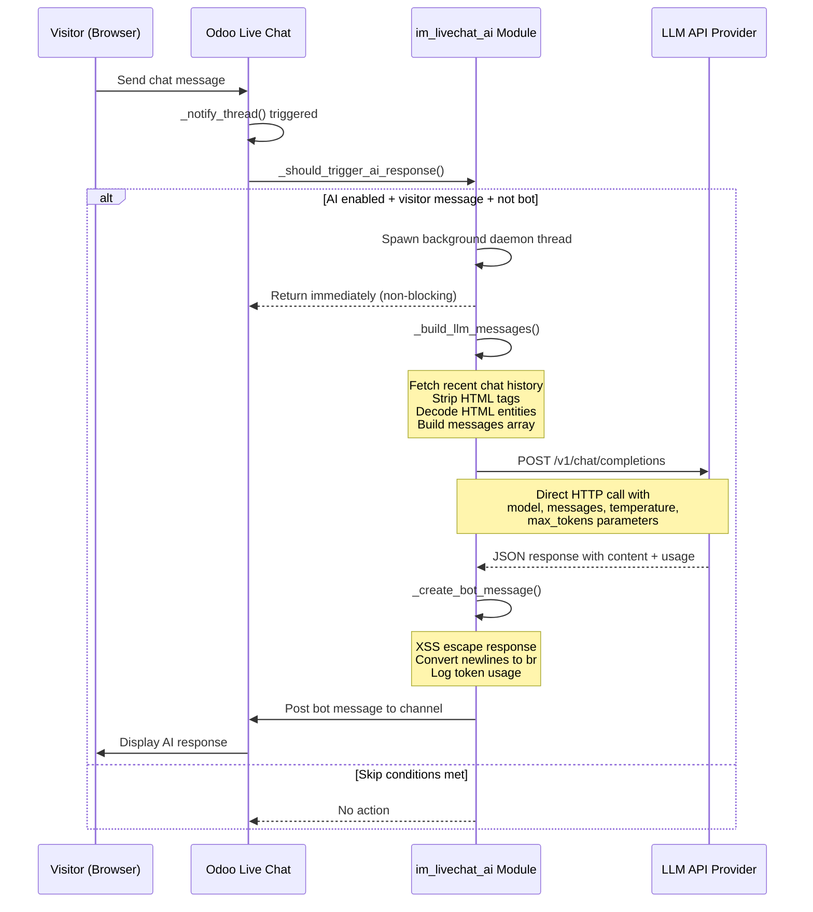
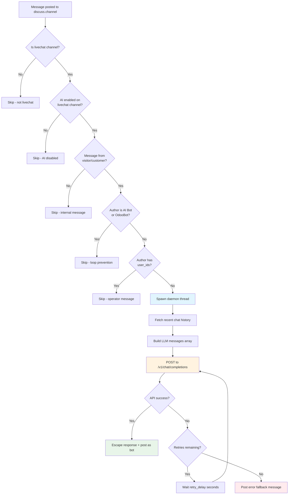

<p align="center">
  
  
  
  
  
</p>

# Live Chat AI Integration for Odoo 18

**Integrate any OpenAI-compatible LLM directly into Odoo Live Chat for automated, intelligent customer support.**

> [繁體中文版 README](README_zh-TW.md)

---

## Table of Contents

- [Overview](#overview)
- [Why Use This Module](#why-use-this-module)
- [Architecture](#architecture)
- [Features](#features)
- [Screenshots](#screenshots)
- [Installation](#installation)
- [Configuration](#configuration)
- [Module Structure](#module-structure)
- [Security](#security)
- [Testing](#testing)
- [Troubleshooting](#troubleshooting)
- [Dependencies](#dependencies)
- [Changelog](#changelog)
- [License](#license)
- [Credits](#credits)

---

## Overview

**im_livechat_ai** is an Odoo 18 module that brings AI-powered automated responses to Odoo's built-in Live Chat feature. It works by intercepting visitor messages at the ORM level and making direct HTTP calls to any OpenAI-compatible LLM API endpoint (`/v1/chat/completions`), then posting the AI-generated response back into the conversation as a bot partner.

Unlike solutions that rely on external orchestration tools or middleware, this module handles the entire AI conversation loop natively within Odoo. Each livechat channel can be independently configured with its own API endpoint, model, system prompt, and behavioral parameters -- giving you full per-channel control over the AI's personality, knowledge domain, and response characteristics.

The module supports any LLM provider that exposes an OpenAI-compatible chat completions API, including OpenAI (GPT-4o, GPT-4, GPT-3.5), DeepSeek, MiniMax, Ollama (local models), Claude-compatible proxies, and any other service following the OpenAI API specification. All API calls execute in background daemon threads so the visitor's chat experience remains fast and unblocked.

---

## Why Use This Module

| Aspect | Without This Module | With This Module |
|---|---|---|
| **Response Time** | Visitors wait for a human agent | AI responds within seconds, 24/7 |
| **Agent Workload** | Every inquiry requires human attention | AI handles routine questions automatically |
| **Setup Complexity** | Build custom integrations from scratch | Install, configure API key, and go |
| **Multi-language** | Depends on agent availability | LLM handles any language natively |
| **Consistency** | Varies by agent | Consistent tone defined by system prompt |
| **Scalability** | Limited by headcount | Handles unlimited concurrent conversations |
| **Cost** | Full-time staff per channel | Pay-per-token API usage |
| **Conversation Context** | Agents must read history manually | AI automatically receives recent chat history |
| **Infrastructure** | External services, middleware, glue code | Everything runs inside Odoo -- zero external dependencies |

---

## Architecture

### High-Level Flow

```
┌─────────────┐     ┌──────────────────┐     ┌─────────────────┐     ┌─────────────┐
│   Visitor    │────>│  Odoo Live Chat  │────>│  im_livechat_ai │────>│  LLM API    │
│  (Browser)   │<────│  (discuss.channel)│<────│  (Background)   │<────│  (External) │
└─────────────┘     └──────────────────┘     └─────────────────┘     └─────────────┘
     Chat UI          _notify_thread()        _call_llm_api()        /v1/chat/
                      Message Hook            Direct HTTP POST       completions
```

### Sequence Diagram



### Decision Flowchart



---

## Features

### Core Capabilities

- **Direct LLM API Integration** -- Makes standard HTTP POST requests to `/v1/chat/completions` endpoints; no middleware, no external tools, no orchestration layer required.
- **Per-Channel AI Configuration** -- Each livechat channel has its own independent AI settings: API endpoint, model, system prompt, temperature, and more.
- **Multi-Turn Conversation Context** -- Automatically fetches recent chat history and structures it as a proper messages array with system/user/assistant roles.
- **Background Processing** -- All API calls run in daemon threads so visitor chat remains responsive and the Odoo main thread is never blocked.
- **Universal LLM Compatibility** -- Works with any provider following the OpenAI chat completions API specification.

### Reliability & Operations

- **Configurable Retry Logic** -- Automatic retries with configurable delay for transient API failures (1-10 attempts, 1-30 second delay).
- **Serialization Failure Recovery** -- Gracefully handles PostgreSQL `SerializationFailure` errors with automatic retry, essential for high-concurrency chat environments.
- **Token Usage Tracking** -- Logs prompt tokens, completion tokens, and total tokens for every API call.
- **API Call Logging** -- Full request/response logging via the `llm.api.log` model with tree and form views.
- **30-Day Auto-Cleanup** -- Scheduled cron job automatically purges API logs older than 30 days.
- **Fallback Error Messages** -- Configurable message shown to visitors when the AI service is unavailable.

### Security & Safety

- **XSS Protection** -- All AI responses are escaped via `markupsafe.Markup.escape()` before posting, with controlled `<br/>` tag insertion for line breaks.
- **HTML Stripping** -- Incoming visitor messages are stripped of HTML tags and entities are decoded before sending to the LLM.
- **Loop Prevention** -- AI bot messages, OdooBot messages, and messages from partners with linked user accounts are all excluded from triggering AI responses.
- **Input Validation** -- URL format validation, numeric range constraints, and required field checks on all configuration parameters.

### User Experience

- **Test AI Connection** -- One-click button in the channel configuration to verify API connectivity and model availability.
- **View API Logs** -- Quick-access action button to jump directly to filtered API logs for the current channel.
- **Custom Bot Identity** -- Per-channel bot partner with configurable display name (default: "AI Assistant").
- **Traditional Chinese Translation** -- Full `zh_TW` locale support included.

---

## Screenshots

### Livechat Channel List

<p align="center">
  
</p>
<p align="center"><em>Overview of livechat channels with AI integration status</em></p>

### AI Configuration Tab

<p align="center">
  
</p>
<p align="center"><em>Per-channel AI configuration with API settings, model selection, system prompt, and behavioral parameters</em></p>

### Admin Discuss View

<p align="center">
  
</p>
<p align="center"><em>Administrator view of AI-powered conversations in Odoo Discuss</em></p>

### Visitor Chat Experience

<p align="center">
  
</p>
<p align="center"><em>Visitor-facing livechat widget with AI responses</em></p>

### End-to-End Test Results

<p align="center">
  
  
</p>
<p align="center"><em>E2E tests: basic greeting (left) and Chinese language support (right)</em></p>

<p align="center">
  
</p>
<p align="center"><em>Stress test with concurrent conversations</em></p>

---

## Installation

### Standard Odoo Installation

1. **Clone the repository** into your Odoo addons directory:

   ```bash
   cd /path/to/odoo/addons
   git clone https://github.com/WOOWTECH/Woow_odoo_ai_livechat.git
   ```

2. **Add to addons path** in your Odoo configuration file (`odoo.conf`):

   ```ini
   addons_path = /path/to/odoo/addons,/path/to/odoo/addons/Woow_odoo_ai_livechat
   ```

3. **Update the module list** in Odoo:

   - Navigate to **Apps** and click **Update Apps List**
   - Search for **"Live Chat AI Integration"**
   - Click **Install**

4. **Ensure dependencies** are installed:

   - The `im_livechat` module must be installed (Odoo's built-in Live Chat)

### Docker / Podman Deployment

A ready-to-use container setup is provided in the `odoo-ailivechat/` directory.

1. **Start the containers:**

   ```bash
   cd odoo-ailivechat/
   docker compose up -d
   # or
   podman-compose up -d
   ```

   This starts two containers:
   - `odoo-ailivechat-web` -- Odoo 18 (port 9094 mapped to internal 8069)
   - `odoo-ailivechat-db` -- PostgreSQL 16

2. **Access Odoo** at `http://localhost:9094`

3. **Module auto-mount:** The `im_livechat_ai` module is automatically mounted at `/mnt/extra-addons` inside the container.

4. **Install the module** through the Odoo Apps interface as described above.

---

## Configuration

After installation, configure AI for each livechat channel:

### Step 1: Open Livechat Channel Settings

Navigate to **Live Chat > Channels**, select a channel, and click the **AI Integration** tab.

### Step 2: Enable AI

| Field | Description |
|---|---|
| **Enable AI Integration** (`ai_enabled`) | Toggle to activate AI responses for this channel. |

### Step 3: Configure API Connection

| Field | Description | Example |
|---|---|---|
| **API Base URL** (`ai_api_base_url`) | Base URL of your LLM API provider. Must be a valid URL. | `https://api.openai.com/v1` |
| **API Key** (`ai_api_key`) | Authentication key for the LLM service. | `sk-proj-...` |
| **Model** (`ai_model`) | Model identifier to use for completions. | `gpt-4o`, `deepseek-chat`, `MiniMax-Text-01` |

### Step 4: Define AI Behavior

| Field | Description | Default |
|---|---|---|
| **System Prompt** (`ai_system_prompt`) | Instructions that define the AI's persona, knowledge scope, and response style. | *(empty)* |
| **Temperature** (`ai_temperature`) | Controls randomness. Lower = more deterministic, higher = more creative. Range: 0.0 - 2.0. | `0.7` |
| **Max Tokens** (`ai_max_tokens`) | Maximum number of tokens in the AI's response. | `1024` |
| **Max History Messages** (`ai_max_history`) | Number of recent messages to include as conversation context. Range: 1 - 200. | `50` |

### Step 5: Configure Reliability

| Field | Description | Default |
|---|---|---|
| **Max Retries** (`ai_max_retries`) | Number of retry attempts when the API call fails. Range: 1 - 10. | `3` |
| **Retry Delay** (`ai_retry_delay`) | Seconds to wait between retry attempts. Range: 1 - 30. | `2` |
| **Error Message** (`ai_error_message`) | Fallback message displayed to the visitor when all retries are exhausted. | *(configurable)* |

### Step 6: Set Bot Identity

| Field | Description | Default |
|---|---|---|
| **Bot Partner** (`ai_bot_partner_id`) | The `res.partner` record used as the message author for AI responses. | Auto-created |
| **Bot Name** (`ai_bot_name`) | Display name for the AI bot in the chat. | `AI Assistant` |

### Step 7: Test & Verify

- Click **Test AI Connection** to send a test request to the configured API and verify connectivity.
- Click **View API Logs** to inspect request/response history and token usage for this channel.

---

## Module Structure

```
im_livechat_ai/
├── __init__.py                          # Module root init
├── __manifest__.py                      # Module manifest (v18.0.1.0.0)
├── models/
│   ├── __init__.py                      # Models init
│   ├── im_livechat_channel.py           # AI config fields (17 fields) + LLM API
│   │                                    #   call logic (_call_llm_api, retry,
│   │                                    #   connection test)
│   ├── discuss_channel.py               # Message interception (_notify_thread
│   │                                    #   override), conversation context
│   │                                    #   builder (_build_llm_messages),
│   │                                    #   bot message creation, loop prevention
│   └── llm_api_log.py                   # API call logging model with fields:
│                                        #   channel, model, tokens, status,
│                                        #   request/response bodies, error info
├── views/
│   ├── im_livechat_channel_views.xml    # "AI Integration" tab on channel form
│   │                                    #   with field groups and action buttons
│   └── llm_api_log_views.xml            # Tree + form views for API log records
├── data/
│   └── ai_data.xml                      # Default AI Bot partner record +
│                                        #   ir.cron for 30-day log cleanup
├── security/
│   └── ir.model.access.csv             # CRUD access rules for llm.api.log
├── tests/
│   ├── __init__.py                      # Test suite init
│   ├── test_im_livechat_ai.py           # 28 core unit tests: field defaults,
│   │                                    #   validation, API call mocking,
│   │                                    #   retry logic, error handling
│   ├── test_discuss_channel.py          # 18 channel tests: message interception,
│   │                                    #   context building, loop prevention,
│   │                                    #   HTML stripping, history limits
│   └── test_integration.py             # 9 integration tests: full flow,
│                                        #   multi-turn conversations,
│                                        #   concurrent sessions, error recovery
└── i18n/
    └── zh_TW.po                         # Traditional Chinese (zh_TW) translation
```

---

## Security

### XSS Protection

All AI-generated responses pass through `markupsafe.Markup.escape()` before being posted to the chat channel. This neutralizes any potentially malicious content that an LLM might generate (e.g., injected `<script>` tags). Newline characters are then converted to safe `<br/>` tags for proper display formatting.

### Input Sanitization

Visitor messages undergo HTML stripping and HTML entity decoding before being included in the LLM prompt. This ensures the LLM receives clean plaintext input regardless of the visitor's message format.

### Loop Prevention

The module implements three layers of protection against message loops:

1. **Bot partner exclusion** -- Messages authored by the channel's configured `ai_bot_partner_id` are ignored.
2. **OdooBot exclusion** -- Messages from the built-in OdooBot partner are ignored.
3. **Operator exclusion** -- Messages from any `res.partner` with linked `user_ids` (i.e., internal Odoo users / operators) are ignored.

This guarantees that only genuine visitor messages trigger AI responses.

### Input Validation

- **URL format**: `ai_api_base_url` is validated to ensure it is a properly formatted URL.
- **Numeric ranges**: Temperature (0.0-2.0), max history (1-200), max retries (1-10), retry delay (1-30), and max tokens are all constrained.
- **Required fields**: Enabling AI requires that the API base URL, API key, and model fields are populated.

### API Key Storage

API keys are stored as standard Odoo `Char` fields with access controlled by Odoo's built-in record-level and field-level security model. For production deployments, ensure that only authorized administrators have write access to livechat channel records.

---

## Testing

### Test Suite Overview

The module includes **55 automated tests** across three test files:

| Test File | Tests | Coverage |
|---|---|---|
| `test_im_livechat_ai.py` | 28 | Core unit tests: field defaults, validation constraints, API call mocking, retry logic, error message handling, token logging |
| `test_discuss_channel.py` | 18 | Channel integration: message interception, `_should_trigger_ai_response()` logic, `_build_llm_messages()` context assembly, HTML stripping, loop prevention scenarios |
| `test_integration.py` | 9 | End-to-end: full message flow, multi-turn conversations, concurrent session handling, serialization failure recovery, error fallback |

### Running the Tests

```bash
# Run all im_livechat_ai tests
./odoo-bin -d your_database --test-enable --stop-after-init -i im_livechat_ai

# Run a specific test file
./odoo-bin -d your_database --test-enable --stop-after-init \
  --test-file addons/im_livechat_ai/tests/test_im_livechat_ai.py

# Run with Docker
docker exec -it odoo-ailivechat-web \
  odoo --test-enable --stop-after-init -d odoo -i im_livechat_ai
```

### E2E Testing

A comprehensive 15-scenario end-to-end test suite was conducted covering:

- Basic greetings and introductions
- Multi-language conversations (English, Chinese, Japanese)
- Product inquiry simulations
- Multi-turn contextual conversations
- Concurrent visitor sessions
- Error recovery and edge cases
- Stress testing with rapid sequential messages

Test plans and results are documented in the `docs/plans/` directory.

---

## Troubleshooting

### AI is not responding to visitor messages

1. **Check AI is enabled**: Open the livechat channel settings and confirm the **AI Integration** toggle is on.
2. **Verify API credentials**: Click **Test AI Connection** to validate the API endpoint and key.
3. **Check the Odoo log**: Look for `im_livechat_ai` log entries in the Odoo server log. API errors are logged at the `warning` level.
4. **Review API logs**: Click **View API Logs** on the channel form to inspect recent request/response records and error details.

### AI responds to operator messages (loop behavior)

This should not happen with correct configuration. Verify that:
- The channel's `ai_bot_partner_id` is set and points to the correct bot partner.
- Operators are internal Odoo users (have `user_ids` linked to their partner records).
- The AI bot partner itself does not have any `user_ids` linked.

### API returns errors

| Error | Cause | Solution |
|---|---|---|
| `401 Unauthorized` | Invalid API key | Verify `ai_api_key` is correct and active |
| `404 Not Found` | Wrong base URL or model | Check `ai_api_base_url` ends correctly (e.g., `/v1` not `/v1/`) and model name is valid |
| `429 Too Many Requests` | Rate limited | Increase `ai_retry_delay`, reduce request frequency, or upgrade API plan |
| `500 Internal Server Error` | Provider-side issue | Retry logic handles this automatically; check provider status page |
| Connection timeout | Network or firewall | Ensure Odoo server can reach the API endpoint; check DNS and firewall rules |

### PostgreSQL serialization failures

In high-concurrency scenarios, PostgreSQL may raise `SerializationFailure` errors. The module handles these automatically with retry logic. If you see persistent serialization errors in the log, consider:
- Reducing transaction isolation level if customized
- Ensuring PostgreSQL connection pooling is properly configured

### Bot messages show raw HTML

Verify that the module is up to date. The XSS protection layer should escape all HTML and convert newlines to `<br/>` tags. If raw HTML appears, ensure `markupsafe` is installed in your Python environment.

---

## Dependencies

### Odoo Modules

| Module | Type | Purpose |
|---|---|---|
| `im_livechat` | Required | Odoo's built-in Live Chat module (base for livechat channels) |

### Python Packages

All required Python packages are part of the standard Odoo 18 distribution:

| Package | Purpose |
|---|---|
| `requests` | HTTP client for LLM API calls |
| `markupsafe` | XSS protection for bot responses |
| `psycopg2` | PostgreSQL adapter (serialization failure handling) |

No additional `pip install` is required beyond a standard Odoo 18 environment.

---

## Changelog

### v18.0.1.0.0 (Initial Release)

- Per-channel AI configuration with 17 configurable fields
- Direct integration with OpenAI-compatible `/v1/chat/completions` API
- Multi-turn conversation context with configurable history depth
- Background daemon thread processing for non-blocking operation
- XSS protection and HTML sanitization pipeline
- Three-layer loop prevention (bot, OdooBot, operators)
- Configurable retry logic with delay for API resilience
- PostgreSQL serialization failure recovery
- Token usage tracking and API call logging
- 30-day automatic log cleanup via scheduled cron
- Test AI Connection and View API Logs action buttons
- 55 automated tests (28 unit + 18 channel + 9 integration)
- 15-scenario end-to-end test coverage
- Traditional Chinese (zh_TW) translation
- Docker / Podman deployment configuration

---

## License

This module is licensed under the **GNU Lesser General Public License v3.0 (LGPL-3)**.

---

## Credits

Developed and maintained by **[WOOWTECH](https://github.com/WOOWTECH)**.

<p align="center">
  <a href="https://github.com/WOOWTECH/Woow_odoo_ai_livechat/issues">Bug Reports & Feature Requests</a>
</p>

---

<p align="center"><sub>Built by <a href="https://github.com/WOOWTECH">WOOWTECH</a> &bull; Powered by Odoo 18</sub></p>
