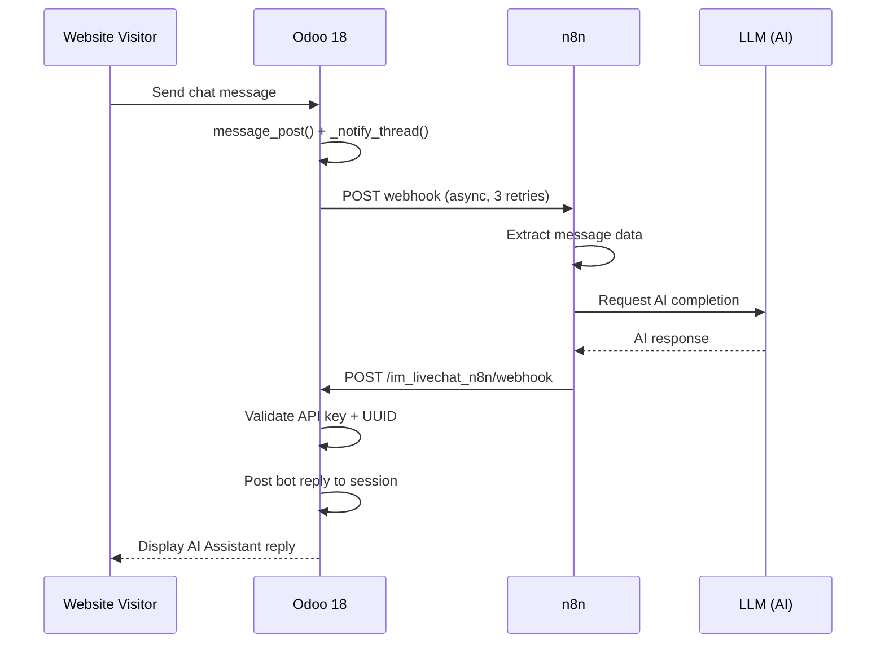
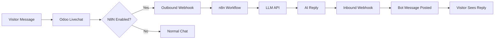
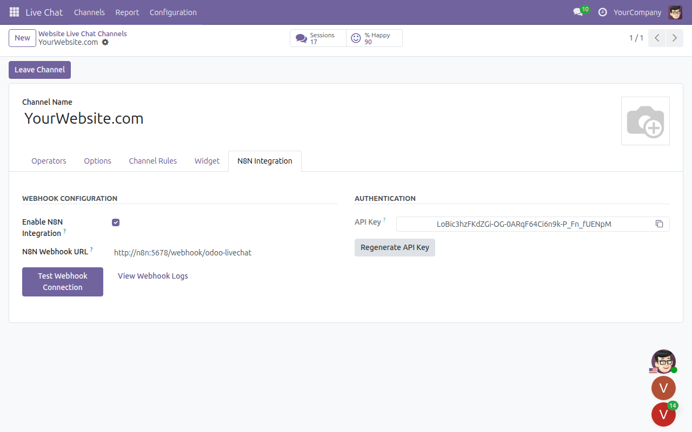
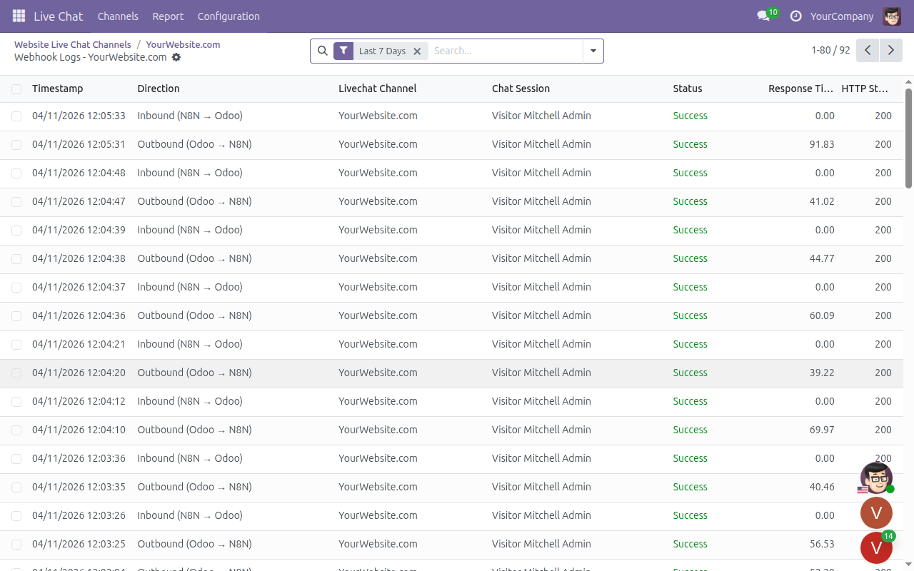

<div align="center">

# Live Chat N8N Integration

### `im_livechat_n8n` -- AI-Powered Customer Support for Odoo 18

[](https://www.odoo.com)
[](https://www.python.org)
[](https://www.gnu.org/licenses/lgpl-3.0)
[](https://n8n.io)
[](https://www.postgresql.org)
[](https://github.com/WOOWTECH/Woow_odoo_n8n_livechat)

**Connect Odoo Live Chat with n8n workflow automation to deliver intelligent,
AI-driven customer support -- without writing a single line of backend AI code.**

[Overview](#overview) |
[Why Use This Module](#why-use-this-module) |
[Features](#features) |
[Screenshots](#screenshots) |
[Installation](#installation) |
[Docker Deployment](#docker--podman-deployment) |
[Configuration](#configuration) |
[n8n Workflow Setup](#n8n-workflow-setup) |
[Security](#security) |
[Testing](#testing) |
[API Reference](#api-reference) |
[Changelog](#changelog) |
[License](#license)

---

</div>

## Overview

**im_livechat_n8n** is an Odoo 18 module developed by [WOOWTECH](https://github.com/WOOWTECH) that bridges the Odoo Live Chat widget with the [n8n](https://n8n.io) workflow automation platform. It enables fully automated, AI-powered customer support chatbots that respond to website visitors in real time.

When a visitor sends a message through the livechat widget, the module fires an outbound webhook to n8n. An n8n workflow processes the message through any LLM provider (OpenRouter/Gemini, OpenAI, Claude, etc.) and sends the AI-generated reply back to Odoo, where it is posted in the livechat session under the identity "AI Assistant".

---

## Why Use This Module

| Without this module | With this module |
|---|---|
| Manual chat replies only | Automated AI replies via n8n |
| No webhook integration | Bidirectional webhook pipeline |
| No audit trail | Full webhook activity logging |
| Single-language support | Multilingual AI responses |
| No retry logic | 3-retry exponential backoff |
| Requires custom code for AI | Zero backend AI code needed |
| No loop prevention | Built-in webhook loop guards |
| No message validation | UUID, size, and format validation |

---

## Architecture

### ASCII Diagram

```
                        Odoo 18                                        n8n
 +------------------------------------------+      +--------------------------------------+
 |                                          |      |                                      |
 |  Website Visitor                         |      |  1. Webhook Trigger                  |
 |       |                                  |      |       |                              |
 |       v                                  |      |       v                              |
 |  Livechat Widget                         |      |  2. Extract Message (Code)           |
 |       |                                  |      |       |                              |
 |       v                                  |      |       v                              |
 |  discuss.channel.message_post()          |      |  3. Call LLM API (HTTP Request)      |
 |       |                                  |      |       |  (OpenRouter / Gemini /       |
 |       v                                  |      |       |   OpenAI / Claude)            |
 |  _notify_thread() hook                   |      |       v                              |
 |       |                                  |      |  4. Build Reply Payload (Code)       |
 |       v                                  |      |       |                              |
 |  _trigger_n8n_webhook()  ---- POST ---------------->    v                              |
 |  (daemon thread, 3 retries)              |      |  5. Send to Odoo (HTTP Request)      |
 |                                          |      |       |                              |
 |  /im_livechat_n8n/webhook/reply <-- POST ----------------+                              |
 |       |                                  |      |                                      |
 |       v                                  |      +--------------------------------------+
 |  Validate API key + UUID                 |
 |       |                                  |
 |       v                                  |
 |  Post bot reply to session               |
 |       |                                  |
 |       v                                  |
 |  Visitor sees AI Assistant reply          |
 |                                          |
 +------------------------------------------+
```

### Sequence Diagram



### Flow Diagram



---

## Features

- **Bidirectional Webhooks** -- Outbound (Odoo to n8n) and inbound (n8n to Odoo) communication over HTTP/JSON.
- **Webhook Loop Prevention** -- The `_is_visitor_message()` method excludes the N8N Bot partner, OdooBot, and any partner with `user_ids` from triggering outbound webhooks, preventing infinite loops.
- **Async Dispatch** -- Outbound webhooks run in daemon threads with 3 retries and exponential backoff (1 s, 2 s, 4 s). Chat operations are never blocked.
- **Thread Safety** -- All ORM field values are captured in the main thread before spawning the webhook thread, avoiding cross-thread cursor access.
- **Per-Channel Configuration** -- Each livechat channel has its own webhook URL, API key, and enable/disable toggle.
- **API Key Security** -- Keys are generated with `secrets.token_urlsafe(32)` (cryptographically secure). One-click regeneration in the UI.
- **Message Validation** -- UUID pattern validation, 10 KB message size limit, and UTF-8 encoding checks on all inbound payloads.
- **Webhook Logging** -- Full bidirectional logging (outbound/inbound) with success, failed, and timeout statuses. Includes response time, HTTP status, and request/response payloads.
- **Cleanup Cron** -- A scheduled action automatically purges old webhook log entries (30-day retention).
- **Test Connection** -- One-click "Test Webhook Connection" button sends a test event to n8n and reports the result instantly.
- **96 Automated Tests** -- Comprehensive test coverage across 3 suites: core, integration, and pre-production.

---

## Screenshots

### Livechat Channels Overview


### N8N Integration Configuration Tab



### Webhook Activity Log



### Admin Discuss View with AI Conversations


### Visitor-Side Livechat Widget


### Test Results

| Basic Greeting (EN) | Chinese UTF-8 Test | Combined Stress Test |
|:---:|:---:|:---:|
|  |  |  |

---

## Installation

### Module Installation (Standard Odoo)

1. **Copy the module** into your Odoo addons directory:

   ```bash
   cp -r im_livechat_n8n /path/to/odoo/addons/
   ```

   Or clone the repository directly:

   ```bash
   cd /path/to/odoo/addons
   git clone https://github.com/WOOWTECH/Woow_odoo_n8n_livechat.git
   ```

2. **Update the apps list** in Odoo:
   - Navigate to **Apps** menu.
   - Click **Update Apps List**.

3. **Install the module**:
   - Search for **"Live Chat N8N"**.
   - Click **Install**.

---

## Docker / Podman Deployment

A production-ready `docker-compose.yml` is provided in the `odoo-n8nlivechat/` directory for quick deployment with Odoo 18 and PostgreSQL 16.

### Service Architecture

| Service | Image | Internal Port | Mapped Port | Purpose |
|---------|-------|:---:|:---:|---------|
| **db** | `postgres:16` | 5432 | -- | PostgreSQL database with health checks |
| **odoo** | `odoo:18.0` | 8069 | **9094** | Odoo 18 application server |

> **Note:** n8n can be added as a separate service or run on a different host. The webhook communication uses standard HTTP, so n8n only needs network access to Odoo's port.

### Quick Start

```bash
cd odoo-n8nlivechat/

# Start the stack
docker compose up -d

# Odoo will be available at http://localhost:9094
```

### With Podman (rootless)

```bash
cd odoo-n8nlivechat/

# Start with Podman Compose
podman-compose up -d

# Odoo will be available at http://localhost:9094
```

### Directory Structure

```
odoo-n8nlivechat/
├── docker-compose.yml          # Service definitions
├── config/
│   └── odoo.conf               # Odoo configuration file
├── addons/
│   └── im_livechat_n8n/        # Module (auto-mounted)
└── data/
    ├── postgres/               # PostgreSQL data (persistent)
    └── odoo/                   # Odoo filestore (persistent)
```

### Key Configuration Details

- **Network:** All services share the `odoo-n8nlivechat-network` bridge network, allowing internal hostname resolution (e.g., `http://odoo:8069` from n8n).
- **Persistence:** Both PostgreSQL data and Odoo filestore are mounted as bind volumes for data durability across restarts.
- **Health checks:** The PostgreSQL container includes a health check; Odoo waits for database readiness before starting.
- **Addons auto-mount:** The `addons/` directory is mounted to `/mnt/extra-addons` inside the Odoo container, so any module placed there is immediately available.

### Adding n8n to the Stack

To run n8n alongside Odoo, add the following service to `docker-compose.yml`:

```yaml
  n8n:
    image: n8nio/n8n:latest
    container_name: odoo-n8nlivechat-n8n
    restart: unless-stopped
    ports:
      - "15678:5678"
    environment:
      - WEBHOOK_URL=http://localhost:15678/
    volumes:
      - ./data/n8n:/home/node/.n8n
    networks:
      - odoo-n8nlivechat-net
```

After adding, n8n will be available at `http://localhost:15678` and can reach Odoo at `http://odoo:8069` over the shared Docker network.

---

## Configuration

### Odoo Side

1. Navigate to **Website > Live Chat > Channels**.
2. Select an existing channel or create a new one.
3. Open the **N8N Integration** tab.
4. Check **Enable N8N Integration**.
5. Enter your **n8n Webhook URL** (the URL from your n8n Webhook Trigger node).
6. An **API Key** is automatically generated. Copy it -- you will need it for the n8n workflow.

> **Tip:** Click **Regenerate API Key** if the key has been compromised, or click **Test Webhook Connection** to verify connectivity.

### n8n Side

After importing or building your workflow (see next section), configure:

- The **Webhook Trigger** node path to match the URL you entered in Odoo.
- The **HTTP Request** node (LLM call) with your API key for OpenRouter, OpenAI, or any other LLM provider.
- The **HTTP Request** node (reply to Odoo) with the Odoo callback URL and the `X-API-Key` header value copied from Odoo.

---

## n8n Workflow Setup

The recommended workflow consists of **5 nodes** arranged in a linear pipeline.

### Node 1 -- Webhook Trigger

| Setting | Value |
|---------|-------|
| HTTP Method | `POST` |
| Path | `/livechat-handler` (or any path you choose) |

This node receives the outbound payload from Odoo whenever a visitor sends a message.

### Node 2 -- Extract Message (Code Node)

```javascript
// Extract fields from the Odoo payload
const sessionUuid = $json.session.uuid;
const messageBody = $json.message.body;
const channelId   = $json.channel.id;
const callbackUrl = $json.metadata.callback_url;

return {
  json: {
    session_uuid: sessionUuid,
    message: messageBody,
    channel_id: channelId,
    callback_url: callbackUrl,
  }
};
```

### Node 3 -- Call LLM (HTTP Request)

| Setting | Value |
|---------|-------|
| Method | `POST` |
| URL | `https://openrouter.ai/api/v1/chat/completions` (example) |
| Authentication | Header Auth with your LLM API key |
| Body (JSON) | See below |

```json
{
  "model": "google/gemini-2.0-flash-exp:free",
  "messages": [
    {
      "role": "system",
      "content": "You are a helpful customer support assistant."
    },
    {
      "role": "user",
      "content": "{{ $json.message }}"
    }
  ]
}
```

Substitute the model and endpoint for your preferred LLM provider (OpenAI, Anthropic Claude, local LLM, etc.).

### Node 4 -- Build Reply (Code Node)

```javascript
// Extract the LLM response
const aiReply = $json.choices[0].message.content;

return {
  json: {
    action: "send_message",
    session_uuid: $('Extract Message').first().json.session_uuid,
    message: {
      body: aiReply,
      author_name: "AI Assistant",
    },
    callback_url: $('Extract Message').first().json.callback_url,
  }
};
```

### Node 5 -- Send to Odoo (HTTP Request)

| Setting | Value |
|---------|-------|
| Method | `POST` |
| URL | `{{ $json.callback_url }}` or `http://odoo:8069/im_livechat_n8n/webhook` (Docker) |
| Headers | `Content-Type: application/json` |
| Headers | `X-API-Key: <your-api-key-from-odoo>` |
| Body | Send the entire JSON from the previous node |

After activating the workflow in n8n, visitor messages in Odoo livechat will receive AI-generated replies automatically.

---

## Module Structure

```
im_livechat_n8n/
├── __init__.py
├── __manifest__.py
├── controllers/
│   ├── __init__.py
│   └── webhook.py                     # Inbound webhook controller
│                                      #   - API key validation
│                                      #   - UUID format checking
│                                      #   - 10 KB message size limit
│                                      #   - Bot message posting
├── models/
│   ├── __init__.py
│   ├── discuss_channel.py             # Outbound trigger
│   │                                  #   - _notify_thread() hook
│   │                                  #   - _is_visitor_message() loop guard
│   ├── im_livechat_channel.py         # Payload builder + async dispatch
│   │                                  #   - _trigger_n8n_webhook() daemon thread
│   │                                  #   - _build_webhook_payload()
│   │                                  #   - 3 retries + exponential backoff
│   │                                  #   - API key generation (secrets.token_urlsafe)
│   └── n8n_webhook_log.py             # Webhook activity logging model
├── views/
│   ├── im_livechat_channel_views.xml  # N8N Integration tab on channel form
│   └── n8n_webhook_log_views.xml      # Webhook log tree + form views
├── data/
│   └── n8n_data.xml                   # N8N Bot partner + cleanup cron job
├── security/
│   └── ir.model.access.csv            # Access control rules
├── tests/
│   ├── __init__.py
│   ├── test_im_livechat_n8n.py        # 20 core unit tests
│   ├── test_line_n8n_integration.py   # 36 cross-module integration tests
│   └── test_n8n_preproduction.py      # 40 pre-production tests
└── doc/
    ├── user_guide_en.md
    └── user_guide_zh_TW.md
```

---

## Security

### API Key Authentication

Every inbound webhook request must include a valid `X-API-Key` header. The key is matched against the livechat channel configuration. Requests with a missing or invalid key receive `401 Unauthorized`.

### Key Generation and Rotation

API keys are generated using Python's `secrets.token_urlsafe(32)`, producing 43-character cryptographically random strings. Keys can be regenerated at any time via the UI button.

### Input Validation

| Check | Details |
|-------|---------|
| UUID format | Must match `^[A-Za-z0-9_-]{6,50}$` (Odoo 18 short alphanumeric format) |
| Message size | Maximum 10 KB (10,240 bytes, UTF-8 encoded) |
| Required fields | `session_uuid` and `message.body` must be present |
| JSON parsing | Malformed JSON returns `400 Bad Request` |

### Webhook Loop Prevention

The `_is_visitor_message()` method ensures that only genuine visitor messages trigger outbound webhooks. The following authors are excluded:

- The **N8N Bot** partner (`im_livechat_n8n.partner_n8n_bot`)
- **OdooBot** (`base.partner_root`)
- Any partner with associated **user accounts** (`user_ids`)

### Best Practices

1. **Use HTTPS** for all webhook URLs in production.
2. **Rotate API keys** periodically using the "Regenerate API Key" button.
3. **Restrict network access** to the `/im_livechat_n8n/webhook` endpoint to known IP ranges if possible.
4. **Monitor webhook logs** regularly for failed or unauthorized requests.

---

## Testing

### Test Suite Overview

The module includes **96 automated tests** across 3 test suites, providing comprehensive coverage from unit tests through pre-production validation.

| Test Suite | File | Tests | Description |
|---|---|:---:|---|
| Core Integration | `test_im_livechat_n8n.py` | 20 | Channel config, webhook dispatch, payload building, log cleanup |
| LINE Cross-Module | `test_line_n8n_integration.py` | 36 | LINE+n8n routing, loop prevention, cross-module message flow |
| Pre-Production | `test_n8n_preproduction.py` | 40 | Retry logic, FK integrity, security hardening, config boundaries |

### Running the Tests

```bash
# Run all tests for the module
./odoo-bin -d your_db --test-enable --stop-after-init -i im_livechat_n8n

# Run a specific test file
./odoo-bin -d your_db --test-enable --stop-after-init --test-tags /im_livechat_n8n

# Docker environment
docker exec -it odoo-n8nlivechat-web \
  odoo --test-enable --stop-after-init -d odoon8nlivechat -i im_livechat_n8n
```

### Pre-Production Test Suite (40 tests)

The pre-production suite (`test_n8n_preproduction.py`) covers 8 categories of production-readiness validation:

| # | Category | Tests | What It Validates |
|:---:|---|:---:|---|
| 1 | Retry & Backoff | 5 | Exponential backoff timing, partial recovery scenarios |
| 2 | FK Integrity & Cascade | 5 | Channel/session deletion safety, orphan log prevention |
| 3 | Webhook Log Lifecycle | 5 | 30-day cleanup, boundary date tests, bulk purge |
| 4 | Bot Partner Name Restoration | 4 | Name mutation safety, identity preservation |
| 5 | Config Boundary Values | 5 | Clamping retries (0 -> 3, 99 -> 10), URL validation |
| 6 | Payload Edge Cases | 5 | NULL author, SQL injection, JSON special characters |
| 7 | Multi-Channel Isolation | 5 | API key routing, per-channel config isolation |
| 8 | Security Hardening | 6 | XSS prevention, header injection, brute-force detection |

### End-to-End Validation

A comprehensive **20-round** manual test was conducted covering three categories:

| Category | Rounds | Description |
|----------|:---:|-------------|
| **Completeness** | 7 | Core functionality: English/Chinese greetings, webhook logging, admin message exclusion, multi-session isolation, rapid-fire messages, configuration toggle |
| **Stability** | 6 | Webhook timeout recovery, large payload handling, special characters, session reconnect, concurrent sessions, long conversation chains |
| **Edge Cases** | 7 | Empty messages, XSS/HTML injection, emoji + CJK + mixed scripts, extremely long messages, URL-heavy content, Unicode edge cases, combined stress test |

**Results:** 20/20 rounds passed. 47 outbound webhooks sent, 45 inbound webhooks received, 0 failures recorded.

---

## API Reference

### Outbound Webhook (Odoo --> n8n)

Sent automatically when a visitor posts a message in a livechat session with N8N integration enabled.

**Method:** `POST`
**URL:** The webhook URL configured on the livechat channel.

**Payload:**

```json
{
  "event_type": "message_received",
  "timestamp": "2025-01-15T10:30:00Z",
  "session": {
    "id": 123,
    "uuid": "aYIEU268MM",
    "name": "Visitor #45",
    "started_at": "2025-01-15T10:25:00Z",
    "visitor_name": "John Doe",
    "visitor_country": "US",
    "visitor_lang": "en_US"
  },
  "message": {
    "id": 456,
    "body": "Hello, I need help with my order",
    "author_id": 789,
    "author_name": "John Doe",
    "author_type": "visitor",
    "created_at": "2025-01-15T10:30:00Z"
  },
  "channel": {
    "id": 1,
    "name": "Website Support"
  },
  "metadata": {
    "odoo_base_url": "https://your-odoo.com",
    "callback_url": "https://your-odoo.com/im_livechat_n8n/webhook",
    "api_key_header": "X-API-Key"
  }
}
```

### Inbound Webhook (n8n --> Odoo)

**Endpoint:** `POST /im_livechat_n8n/webhook`

**Headers:**

| Header | Required | Description |
|--------|:---:|-------------|
| `Content-Type` | Yes | `application/json` |
| `X-API-Key` | Yes | API key from the Odoo livechat channel configuration |

**Request Body:**

```json
{
  "action": "send_message",
  "session_uuid": "aYIEU268MM",
  "message": {
    "body": "Thank you for reaching out! How can I help you today?",
    "author_name": "AI Assistant"
  }
}
```

**Response Codes:**

| Code | Meaning |
|:---:|---------|
| `200` | Message posted successfully |
| `400` | Invalid payload (missing fields, invalid UUID format, message exceeds 10 KB) |
| `401` | Missing or invalid API key |
| `404` | Session not found |
| `500` | Internal server error |

**Success Response:**

```json
{
  "status": "ok",
  "session_uuid": "aYIEU268MM",
  "message": "Message posted successfully"
}
```

---

## Troubleshooting

### Webhook Not Firing

1. Verify **Enable N8N Integration** is checked on the channel.
2. Confirm the **webhook URL** is correct and reachable from the Odoo server.
3. Click **Test Webhook Connection** for instant feedback.
4. Check the **Webhook Logs** for error details.

### n8n Not Receiving Messages

1. Ensure the n8n workflow is **active** (not in test/draft mode).
2. Verify network connectivity between Odoo and n8n (firewalls, Docker networks).
3. Review Odoo server logs for `odoo.addons.im_livechat_n8n` entries.

### Replies Not Appearing in Chat

1. Confirm the `X-API-Key` header value matches the key shown in Odoo.
2. Verify the `session_uuid` in the reply payload matches the original session.
3. Ensure the session is still active (not closed by the visitor).
4. Check inbound webhook logs in Odoo for error messages.

### Docker-Specific Issues

1. Verify all containers are running: `docker compose ps`
2. Check container logs: `docker compose logs -f odoo`
3. Ensure the database health check passes: `docker compose logs db`
4. Confirm network connectivity: `docker exec odoo-n8nlivechat-web curl -s http://db:5432 || echo "DB unreachable"`

---

## Dependencies

| Module | Type | Purpose |
|--------|------|---------|
| `im_livechat` | Odoo Core | Provides the livechat channel model and widget |
| `mail` | Odoo Core | Provides `discuss.channel`, `mail.message`, and messaging infrastructure |

---

## Changelog

### v18.0.1.0.0 (2026-04-11)

- Initial release
- Bidirectional webhook integration (Odoo <-> n8n)
- Per-channel webhook configuration with API key authentication
- Async webhook dispatch with 3-retry exponential backoff
- Webhook loop prevention (excludes bot/operator messages)
- Full webhook activity logging with 30-day auto-cleanup
- Bot partner identity for AI-attributed messages
- Input validation: UUID format, 10 KB message limit, JSON parsing
- 96 automated tests (20 core + 36 integration + 40 pre-production)
- Docker/Podman deployment configuration
- Bilingual documentation (English + Traditional Chinese)

---

## License

This module is licensed under the [GNU Lesser General Public License v3.0 (LGPL-3)](https://www.gnu.org/licenses/lgpl-3.0.html).

---

## Credits

Developed and maintained by **[WOOWTECH](https://github.com/WOOWTECH)**.

---

<div align="center">

**[Bug Reports & Feature Requests](https://github.com/WOOWTECH/Woow_odoo_n8n_livechat/issues)**

---

*Also available in:* [*&#x4E2D;&#x6587; (&#x7E41;&#x9AD4;)*](README_zh-TW.md)

</div>
