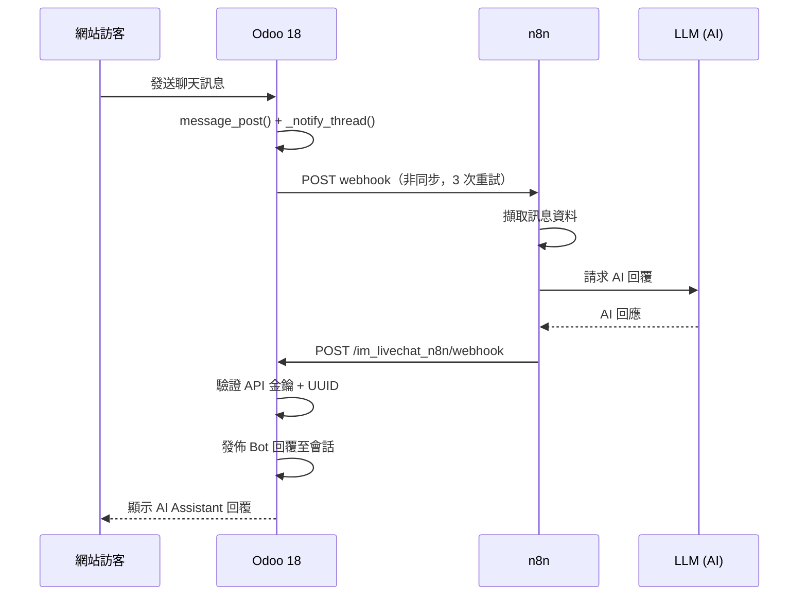
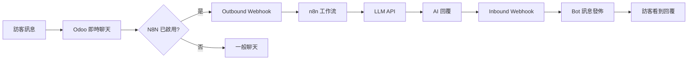

<h1 align="center">Live Chat N8N 整合模組</h1>

<p align="center">
  <strong>Odoo 18 AI 驅動客戶支援 — 透過 n8n 工作流自動化</strong><br/>
  連接 Odoo 即時聊天與 n8n，無需撰寫任何後端 AI 程式碼
</p>

<p align="center">
  <a href="#概述">概述</a> &bull;
  <a href="#為什麼使用此模組">為什麼使用此模組</a> &bull;
  <a href="#功能特色">功能特色</a> &bull;
  <a href="#截圖展示">截圖展示</a> &bull;
  <a href="#安裝指南">安裝指南</a> &bull;
  <a href="#配置說明">配置說明</a> &bull;
  <a href="#安全性">安全性</a> &bull;
  <a href="#測試">測試</a> &bull;
  <a href="#api-參考">API</a> &bull;
  <a href="README.md">English</a>
</p>

<p align="center">
  
  
  
  
  
  
</p>

---

## 概述

**im_livechat_n8n** 是由 [WOOWTECH](https://github.com/WOOWTECH) 開發的 Odoo 18 模組，將 Odoo 即時聊天小工具與 [n8n](https://n8n.io) 工作流自動化平台連接。它實現了全自動的 AI 驅動客服聊天機器人，能即時回應網站訪客。

當訪客透過即時聊天小工具發送訊息時，模組會向 n8n 發送 outbound webhook。n8n 工作流會透過任何 LLM 供應商（OpenRouter/Gemini、OpenAI、Claude 等）處理訊息，並將 AI 生成的回覆發送回 Odoo，以「AI Assistant」的身份發佈在即時聊天會話中。

---

## 為什麼使用此模組

| 沒有此模組 | 使用此模組 |
|---|---|
| 僅能手動回覆聊天 | 透過 n8n 自動 AI 回覆 |
| 沒有 webhook 整合 | 雙向 webhook 通訊管道 |
| 沒有稽核記錄 | 完整的 webhook 活動日誌 |
| 僅支援單一語言 | 多語言 AI 回覆 |
| 沒有重試機制 | 三次重試指數退避 |
| 需要自訂 AI 程式碼 | 零後端 AI 程式碼 |
| 沒有迴圈防護 | 內建 webhook 迴圈防護 |
| 沒有訊息驗證 | UUID、大小和格式驗證 |

---

## 架構

### ASCII 流程圖

```
                        Odoo 18                                        n8n
 +------------------------------------------+      +--------------------------------------+
 |                                          |      |                                      |
 |  Website Visitor                         |      |  1. Webhook Trigger                  |
 |       |                                  |      |       |                              |
 |       v                                  |      |       v                              |
 |  Livechat Widget                         |      |  2. Extract Message (Code)           |
 |       |                                  |      |       |                              |
 |       v                                  |      |       v                              |
 |  discuss.channel.message_post()          |      |  3. Call LLM API (HTTP Request)      |
 |       |                                  |      |       |  (OpenRouter / Gemini /       |
 |       v                                  |      |       |   OpenAI / Claude)            |
 |  _notify_thread() hook                   |      |       v                              |
 |       |                                  |      |  4. Build Reply Payload (Code)       |
 |       v                                  |      |       |                              |
 |  _trigger_n8n_webhook()  ---- POST ---------------->    v                              |
 |  (daemon thread, 3 retries)              |      |  5. Send to Odoo (HTTP Request)      |
 |                                          |      |       |                              |
 |  /im_livechat_n8n/webhook/reply <-- POST ----------------+                              |
 |       |                                  |      |                                      |
 |       v                                  |      +--------------------------------------+
 |  Validate API key + UUID                 |
 |       |                                  |
 |       v                                  |
 |  Post bot reply to session               |
 |       |                                  |
 |       v                                  |
 |  Visitor sees AI Assistant reply          |
 |                                          |
 +------------------------------------------+
```

### 時序圖



### 流程圖



---

## 功能特色

- **雙向 Webhook** -- 透過 HTTP/JSON 實現 Outbound（Odoo 到 n8n）和 Inbound（n8n 到 Odoo）通訊。
- **Webhook 迴圈防護** -- `_is_visitor_message()` 方法排除 N8N Bot、OdooBot 及任何具有 `user_ids` 的夥伴，防止無限迴圈。
- **非同步調度** -- Outbound webhook 在守護執行緒中運行，具有 3 次重試和指數退避（1秒、2秒、4秒）。聊天操作永不被阻塞。
- **執行緒安全** -- 所有 ORM 欄位值在主執行緒中擷取後才產生 webhook 執行緒，避免跨執行緒 cursor 存取。
- **每通道獨立配置** -- 每個即時聊天通道擁有獨立的 webhook URL、API 金鑰和啟用/停用開關。
- **API 金鑰安全** -- 使用 `secrets.token_urlsafe(32)` 生成密碼學安全金鑰。UI 提供一鍵重新生成。
- **訊息驗證** -- 所有 inbound 請求均進行 UUID 格式驗證、10 KB 訊息大小限制和 UTF-8 編碼檢查。
- **Webhook 日誌** -- 完整的雙向日誌記錄（outbound/inbound），包含成功、失敗和逾時狀態，以及回應時間、HTTP 狀態碼和請求/回應內容。
- **自動清理排程** -- 排程動作自動清除過期的 webhook 日誌（30 天保留）。
- **連線測試** -- 一鍵「測試 Webhook 連線」按鈕發送測試事件到 n8n 並即時回報結果。
- **96 項自動化測試** -- 全面的測試覆蓋，涵蓋 3 個測試套件：核心、整合和預生產。

---

## 截圖展示

### 即時聊天通道總覽

<p align="center"></p>

### N8N 整合配置頁面

<p align="center"></p>

### Webhook 活動日誌

<p align="center"></p>

### 管理員對話檢視（AI 對話）

<p align="center"></p>

### 訪客端即時聊天介面

<p align="center"></p>

### 測試結果

| 基礎英文問候測試 | 中文 UTF-8 測試 | 組合壓力測試 |
|:---:|:---:|:---:|
|  |  |  |

---

## 安裝指南

### 模組安裝（標準 Odoo）

1. **將模組複製到 Odoo addons 目錄**：

   ```bash
   cp -r im_livechat_n8n /path/to/odoo/addons/
   ```

   或直接 clone 儲存庫：

   ```bash
   cd /path/to/odoo/addons
   git clone https://github.com/WOOWTECH/Woow_odoo_n8n_livechat.git
   ```

2. **更新應用程式列表**：
   - 前往 **應用程式** 選單
   - 點選「更新應用程式列表」

3. **安裝模組**：
   - 搜尋 **「Live Chat N8N」**
   - 點選 **安裝**

### Docker / Podman 部署

`odoo-n8nlivechat/` 目錄中提供了生產就緒的 `docker-compose.yml`，可使用 Odoo 18 和 PostgreSQL 16 快速部署。

#### 服務架構

| 服務 | 映像檔 | 內部連接埠 | 對外連接埠 | 用途 |
|------|--------|:---:|:---:|------|
| **db** | `postgres:16` | 5432 | -- | PostgreSQL 資料庫，含健康檢查 |
| **odoo** | `odoo:18.0` | 8069 | **9094** | Odoo 18 應用程式伺服器 |

> **注意：** n8n 可作為獨立服務或在不同主機上運行。Webhook 通訊使用標準 HTTP，因此 n8n 只需能存取 Odoo 的連接埠。

#### 快速啟動

```bash
cd odoo-n8nlivechat/

# 啟動服務
docker compose up -d

# Odoo 可透過 http://localhost:9094 存取
```

#### 使用 Podman（rootless）

```bash
cd odoo-n8nlivechat/

# 使用 Podman Compose 啟動
podman-compose up -d

# Odoo 可透過 http://localhost:9094 存取
```

#### 目錄結構

```
odoo-n8nlivechat/
├── docker-compose.yml          # 服務定義
├── config/
│   └── odoo.conf               # Odoo 配置檔
├── addons/
│   └── im_livechat_n8n/        # 模組（自動掛載）
└── data/
    ├── postgres/               # PostgreSQL 資料（持久化）
    └── odoo/                   # Odoo filestore（持久化）
```

#### 關鍵配置

- **網路：** 所有服務共用 `odoo-n8nlivechat-network` bridge 網路，允許內部主機名稱解析（例如 n8n 可透過 `http://odoo:8069` 存取 Odoo）。
- **持久化：** PostgreSQL 資料和 Odoo filestore 均以 bind volume 掛載，確保重啟後資料持久化。
- **健康檢查：** PostgreSQL 容器包含健康檢查；Odoo 在資料庫就緒後才啟動。
- **Addons 自動掛載：** `addons/` 目錄掛載至容器內的 `/mnt/extra-addons`，放入的模組立即可用。

#### 加入 n8n 至部署環境

若要與 Odoo 一起運行 n8n，請在 `docker-compose.yml` 中加入以下服務：

```yaml
  n8n:
    image: n8nio/n8n:latest
    container_name: odoo-n8nlivechat-n8n
    restart: unless-stopped
    ports:
      - "15678:5678"
    environment:
      - WEBHOOK_URL=http://localhost:15678/
    volumes:
      - ./data/n8n:/home/node/.n8n
    networks:
      - odoo-n8nlivechat-net
```

加入後，n8n 可透過 `http://localhost:15678` 存取，並可透過共用的 Docker 網路以 `http://odoo:8069` 存取 Odoo。

---

## 配置說明

### Odoo 端

1. 前往 **網站 > 即時聊天 > 通道**。
2. 選擇現有通道或建立新通道。
3. 開啟 **N8N Integration** 分頁。
4. 勾選 **Enable N8N Integration**。
5. 輸入 **n8n Webhook URL**（n8n Webhook Trigger 節點的 URL）。
6. **API Key** 會自動產生。複製該金鑰 -- 稍後設定 n8n 時需要使用。

> **提示：** 若金鑰已外洩，請點選 **Regenerate API Key** 重新產生。點選 **Test Webhook Connection** 可驗證連線狀態。

### n8n 端

匯入或建立工作流後（參見下一章節），需配置：

- **Webhook Trigger** 節點路徑，須與您在 Odoo 中輸入的 URL 一致。
- **HTTP Request** 節點（LLM 呼叫）-- 設定 OpenRouter、OpenAI 或其他 LLM 供應商的 API 金鑰。
- **HTTP Request** 節點（回覆 Odoo）-- 設定 Odoo 回呼 URL 和從 Odoo 複製的 `X-API-Key` header 值。

---

## n8n 工作流設定

建議工作流由 **5 個節點** 組成，以線性管線排列。

### 節點 1 -- Webhook Trigger

| 設定 | 值 |
|------|-----|
| HTTP 方法 | `POST` |
| 路徑 | `/livechat-handler`（或您自訂的路徑） |

此節點在訪客發送訊息時接收來自 Odoo 的 outbound payload。

### 節點 2 -- Extract Message（Code 節點）

```javascript
// Extract fields from the Odoo payload
const sessionUuid = $json.session.uuid;
const messageBody = $json.message.body;
const channelId   = $json.channel.id;
const callbackUrl = $json.metadata.callback_url;

return {
  json: {
    session_uuid: sessionUuid,
    message: messageBody,
    channel_id: channelId,
    callback_url: callbackUrl,
  }
};
```

### 節點 3 -- Call LLM（HTTP Request）

| 設定 | 值 |
|------|-----|
| 方法 | `POST` |
| URL | `https://openrouter.ai/api/v1/chat/completions`（範例） |
| 認證 | Header Auth，使用您的 LLM API 金鑰 |
| Body (JSON) | 見下方 |

```json
{
  "model": "google/gemini-2.0-flash-exp:free",
  "messages": [
    {
      "role": "system",
      "content": "You are a helpful customer support assistant."
    },
    {
      "role": "user",
      "content": "{{ $json.message }}"
    }
  ]
}
```

可替換為您偏好的 LLM 供應商之模型和端點（OpenAI、Anthropic Claude、本地 LLM 等）。

### 節點 4 -- Build Reply（Code 節點）

```javascript
// Extract the LLM response
const aiReply = $json.choices[0].message.content;

return {
  json: {
    action: "send_message",
    session_uuid: $('Extract Message').first().json.session_uuid,
    message: {
      body: aiReply,
      author_name: "AI Assistant",
    },
    callback_url: $('Extract Message').first().json.callback_url,
  }
};
```

### 節點 5 -- Send to Odoo（HTTP Request）

| 設定 | 值 |
|------|-----|
| 方法 | `POST` |
| URL | `{{ $json.callback_url }}` 或 `http://odoo:8069/im_livechat_n8n/webhook`（Docker） |
| Headers | `Content-Type: application/json` |
| Headers | `X-API-Key: <your-api-key-from-odoo>` |
| Body | 傳送前一節點的完整 JSON |

在 n8n 中啟用工作流後，Odoo 即時聊天中的訪客訊息將自動收到 AI 生成的回覆。

---

## 模組結構

```
im_livechat_n8n/
├── __init__.py
├── __manifest__.py
├── controllers/
│   ├── __init__.py
│   └── webhook.py                     # Inbound webhook controller
│                                      #   - API key validation
│                                      #   - UUID format checking
│                                      #   - 10 KB message size limit
│                                      #   - Bot message posting
├── models/
│   ├── __init__.py
│   ├── discuss_channel.py             # Outbound trigger
│   │                                  #   - _notify_thread() hook
│   │                                  #   - _is_visitor_message() loop guard
│   ├── im_livechat_channel.py         # Payload builder + async dispatch
│   │                                  #   - _trigger_n8n_webhook() daemon thread
│   │                                  #   - _build_webhook_payload()
│   │                                  #   - 3 retries + exponential backoff
│   │                                  #   - API key generation (secrets.token_urlsafe)
│   └── n8n_webhook_log.py             # Webhook activity logging model
├── views/
│   ├── im_livechat_channel_views.xml  # N8N Integration tab on channel form
│   └── n8n_webhook_log_views.xml      # Webhook log tree + form views
├── data/
│   └── n8n_data.xml                   # N8N Bot partner + cleanup cron job
├── security/
│   └── ir.model.access.csv            # Access control rules
├── tests/
│   ├── __init__.py
│   ├── test_im_livechat_n8n.py        # 20 core unit tests
│   ├── test_line_n8n_integration.py   # 36 cross-module integration tests
│   └── test_n8n_preproduction.py      # 40 pre-production tests
└── doc/
    ├── user_guide_en.md
    └── user_guide_zh_TW.md
```

---

## 安全性

### API 金鑰認證

每個 inbound webhook 請求必須在 `X-API-Key` header 中攜帶有效的 API 金鑰。系統會將該金鑰與即時聊天通道配置進行比對。缺少金鑰或金鑰無效的請求將收到 `401 Unauthorized` 回應。

### 金鑰生成與輪換

API 金鑰使用 Python 的 `secrets.token_urlsafe(32)` 生成，產生 43 字元的密碼學隨機字串。可隨時透過 UI 按鈕重新生成金鑰。

### 輸入驗證

| 檢查項目 | 詳細說明 |
|----------|----------|
| UUID 格式 | 必須符合 `^[A-Za-z0-9_-]{6,50}$`（Odoo 18 短英數格式） |
| 訊息大小 | 最大 10 KB（10,240 bytes，UTF-8 編碼） |
| 必填欄位 | `session_uuid` 和 `message.body` 必須存在 |
| JSON 解析 | 格式錯誤的 JSON 回傳 `400 Bad Request` |

### Webhook 迴圈防護

`_is_visitor_message()` 方法確保只有真正的訪客訊息觸發 outbound webhook。以下作者會被排除：

- **N8N Bot** 夥伴（`im_livechat_n8n.partner_n8n_bot`）
- **OdooBot**（`base.partner_root`）
- 任何具有關聯 **使用者帳號** 的夥伴（`user_ids`）

### 安全最佳實踐

1. **使用 HTTPS** -- 正式環境中所有 webhook URL 務必使用 HTTPS。
2. **定期輪換金鑰** -- 使用「Regenerate API Key」按鈕定期重新生成 API 金鑰。
3. **限制網路存取** -- 盡可能限制 `/im_livechat_n8n/webhook` 端點僅接受已知 IP 範圍的請求。
4. **監控 Webhook 日誌** -- 定期檢視 webhook 日誌，偵測失敗或未授權的請求。

---

## 測試

### 測試套件總覽

模組包含 **96 項自動化測試**，分佈於 3 個測試套件，提供從單元測試到預生產驗證的全面覆蓋。

| 測試套件 | 檔案 | 測試數 | 描述 |
|---|---|:---:|---|
| 核心整合 | `test_im_livechat_n8n.py` | 20 | 通道配置、webhook 調度、payload 建構、日誌清理 |
| LINE 跨模組 | `test_line_n8n_integration.py` | 36 | LINE+n8n 路由、迴圈防護、跨模組訊息流 |
| 預生產 | `test_n8n_preproduction.py` | 40 | 重試邏輯、FK 完整性、安全強化、配置邊界 |

### 執行測試

```bash
# 執行模組全部測試
./odoo-bin -d your_db --test-enable --stop-after-init -i im_livechat_n8n

# 執行特定測試檔案
./odoo-bin -d your_db --test-enable --stop-after-init --test-tags /im_livechat_n8n

# Docker 環境
docker exec -it odoo-n8nlivechat-web \
  odoo --test-enable --stop-after-init -d odoon8nlivechat -i im_livechat_n8n
```

### 預生產測試套件（40 項測試）

預生產套件（`test_n8n_preproduction.py`）涵蓋 8 大類生產就緒驗證：

| # | 類別 | 測試數 | 驗證內容 |
|:---:|---|:---:|---|
| 1 | 重試與退避 | 5 | 指數退避時序、部分恢復情境 |
| 2 | FK 完整性與級聯 | 5 | 通道/會話刪除安全、孤立日誌防護 |
| 3 | Webhook 日誌生命週期 | 5 | 30 天清理、邊界日期測試、批量清除 |
| 4 | Bot 夥伴名稱還原 | 4 | 名稱變更安全、身份保護 |
| 5 | 配置邊界值 | 5 | 重試次數夾限（0->3, 99->10）、URL 驗證 |
| 6 | Payload 邊界案例 | 5 | NULL 作者、SQL 注入、JSON 特殊字元 |
| 7 | 多通道隔離 | 5 | API 金鑰路由、每通道配置隔離 |
| 8 | 安全強化 | 6 | XSS 防護、header 注入、暴力破解偵測 |

### 端對端驗證

另外進行了完整的 **20 輪** 手動測試，涵蓋三大類別：

| 類別 | 輪次 | 描述 |
|------|:---:|------|
| **完整性** | 7 | 核心功能：英文/中文問候、webhook 日誌、管理員訊息排除、多會話隔離、快速連發、配置開關 |
| **穩定性** | 6 | Webhook 逾時恢復、大型 payload 處理、特殊字元、會話重連、並行會話、長對話鏈 |
| **邊界案例** | 7 | 空訊息、XSS/HTML 注入、表情符號 + CJK + 混合腳本、超長訊息、URL 密集內容、Unicode 邊界案例、組合壓力測試 |

**結果：** 20/20 輪全數通過。47 次 outbound webhook 發送、45 次 inbound webhook 接收、0 次失敗。

---

## API 參考

### Outbound Webhook（Odoo --> n8n）

當啟用 N8N 整合的即時聊天會話中有訪客發送訊息時自動發送。

**方法：** `POST`
**URL：** 即時聊天通道上配置的 webhook URL。

**Payload：**

```json
{
  "event_type": "message_received",
  "timestamp": "2025-01-15T10:30:00Z",
  "session": {
    "id": 123,
    "uuid": "aYIEU268MM",
    "name": "Visitor #45",
    "started_at": "2025-01-15T10:25:00Z",
    "visitor_name": "John Doe",
    "visitor_country": "US",
    "visitor_lang": "en_US"
  },
  "message": {
    "id": 456,
    "body": "Hello, I need help with my order",
    "author_id": 789,
    "author_name": "John Doe",
    "author_type": "visitor",
    "created_at": "2025-01-15T10:30:00Z"
  },
  "channel": {
    "id": 1,
    "name": "Website Support"
  },
  "metadata": {
    "odoo_base_url": "https://your-odoo.com",
    "callback_url": "https://your-odoo.com/im_livechat_n8n/webhook",
    "api_key_header": "X-API-Key"
  }
}
```

### Inbound Webhook（n8n --> Odoo）

**端點：** `POST /im_livechat_n8n/webhook`

**Headers：**

| Header | 必填 | 說明 |
|--------|:---:|------|
| `Content-Type` | 是 | `application/json` |
| `X-API-Key` | 是 | 來自 Odoo 即時聊天通道配置的 API 金鑰 |

**請求內容：**

```json
{
  "action": "send_message",
  "session_uuid": "aYIEU268MM",
  "message": {
    "body": "感謝您的來訊！請問有什麼可以幫忙的？",
    "author_name": "AI Assistant"
  }
}
```

**回應狀態碼：**

| 狀態碼 | 說明 |
|:---:|------|
| `200` | 訊息發送成功 |
| `400` | 無效的 payload（缺少欄位、UUID 格式錯誤、訊息超過 10 KB） |
| `401` | 缺少或無效的 API 金鑰 |
| `404` | 找不到會話 |
| `500` | 內部伺服器錯誤 |

**成功回應：**

```json
{
  "status": "ok",
  "session_uuid": "aYIEU268MM",
  "message": "Message posted successfully"
}
```

---

## 疑難排解

### Webhook 未觸發

1. 確認通道上已勾選 **Enable N8N Integration**。
2. 確認 **webhook URL** 正確且可從 Odoo 伺服器存取。
3. 點選 **Test Webhook Connection** 取得即時回饋。
4. 檢查 **Webhook 日誌** 中的錯誤詳情。

### n8n 未收到訊息

1. 確認 n8n 工作流已**啟用**（非測試/草稿模式）。
2. 驗證 Odoo 與 n8n 之間的網路連線（防火牆、Docker 網路）。
3. 檢視 Odoo 伺服器日誌中的 `odoo.addons.im_livechat_n8n` 條目。

### 回覆未顯示在聊天中

1. 確認 `X-API-Key` header 值與 Odoo 中顯示的金鑰一致。
2. 驗證回覆 payload 中的 `session_uuid` 與原始會話相符。
3. 確認會話仍處於活動狀態（未被訪客關閉）。
4. 檢視 Odoo 中的 inbound webhook 日誌是否有錯誤訊息。

### Docker 相關問題

1. 確認所有容器正在運行：`docker compose ps`
2. 檢查容器日誌：`docker compose logs -f odoo`
3. 確認資料庫健康檢查通過：`docker compose logs db`
4. 確認網路連線：`docker exec odoo-n8nlivechat-web curl -s http://db:5432 || echo "DB unreachable"`

---

## 相依模組

| 模組 | 類型 | 用途 |
|------|------|------|
| `im_livechat` | Odoo 核心 | 提供即時聊天通道模型和小工具 |
| `mail` | Odoo 核心 | 提供 `discuss.channel`、`mail.message` 和訊息基礎架構 |

---

## 更新紀錄

### v18.0.1.0.0 (2026-04-11)

- 初始版本發佈
- 雙向 webhook 整合（Odoo <-> n8n）
- 每通道 webhook 配置與 API 金鑰認證
- 非同步 webhook 調度，三次重試指數退避
- Webhook 迴圈防護（排除機器人/操作員訊息）
- 完整 webhook 活動日誌，30 天自動清理
- Bot 夥伴身份用於 AI 歸屬訊息
- 輸入驗證：UUID 格式、10KB 訊息限制、JSON 解析
- 96 項自動化測試（20 核心 + 36 整合 + 40 預生產）
- Docker/Podman 部署配置
- 雙語文件（英文 + 繁體中文）

---

## 授權條款

本模組採用 [GNU 較寬鬆通用公共授權條款 v3.0 (LGPL-3)](https://www.gnu.org/licenses/lgpl-3.0.html) 發佈。

---

<p align="center">
  <sub>Built with ❤️ by <a href="https://github.com/WOOWTECH">WOOWTECH</a> &bull; Powered by Odoo 18</sub>
</p>
