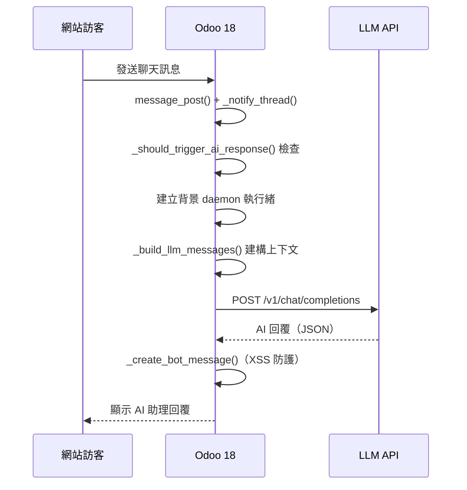
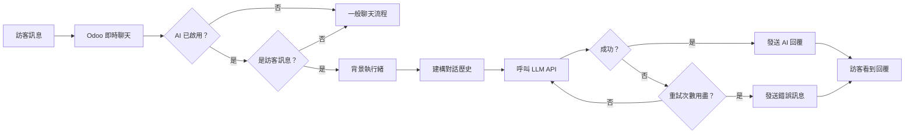
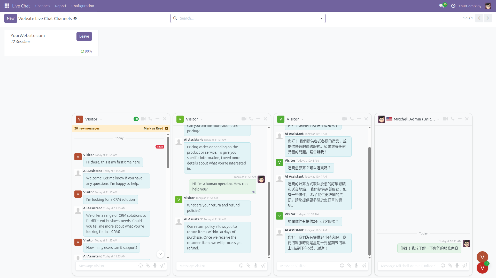
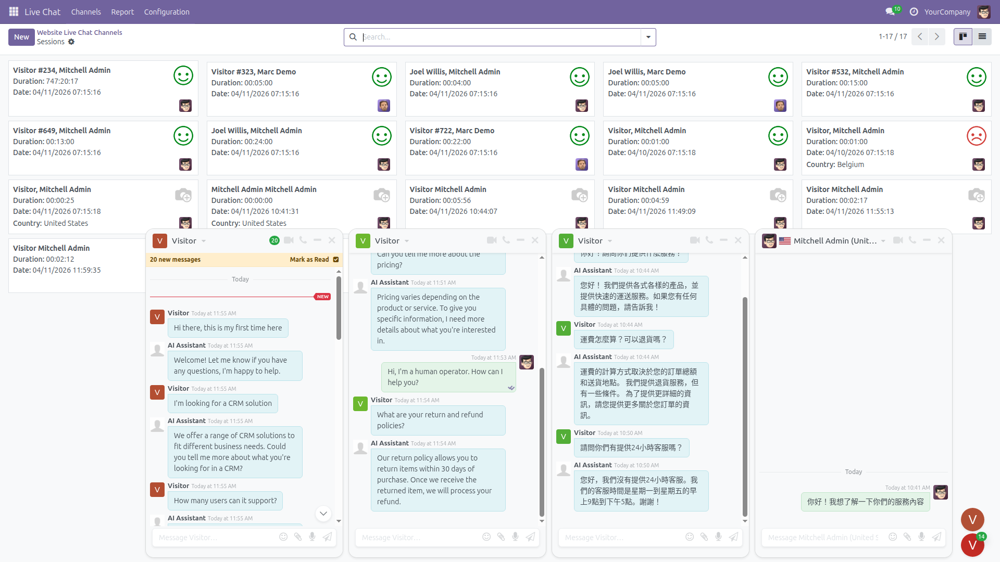
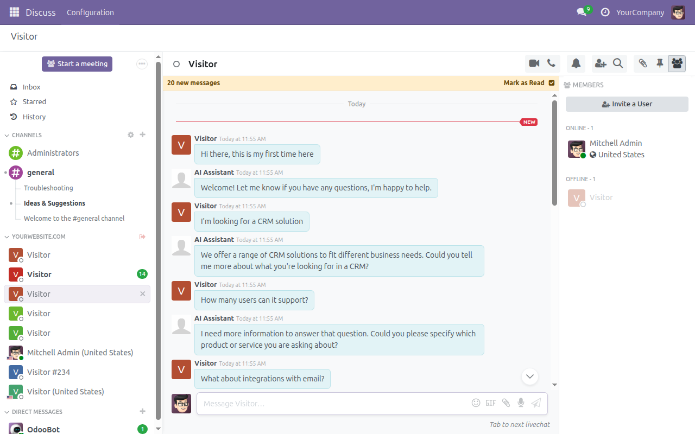
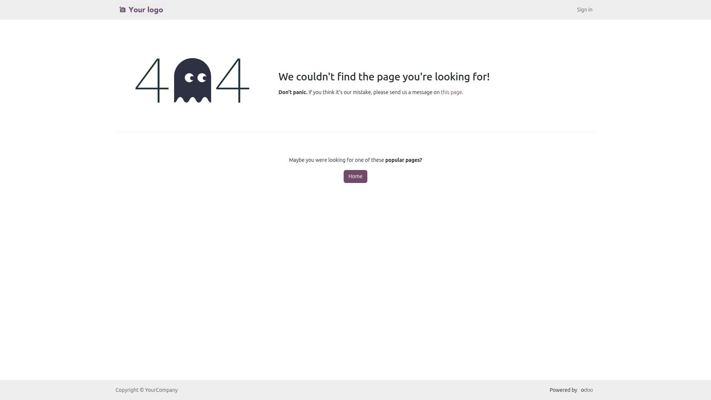
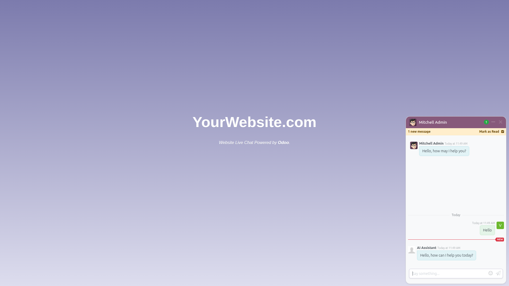
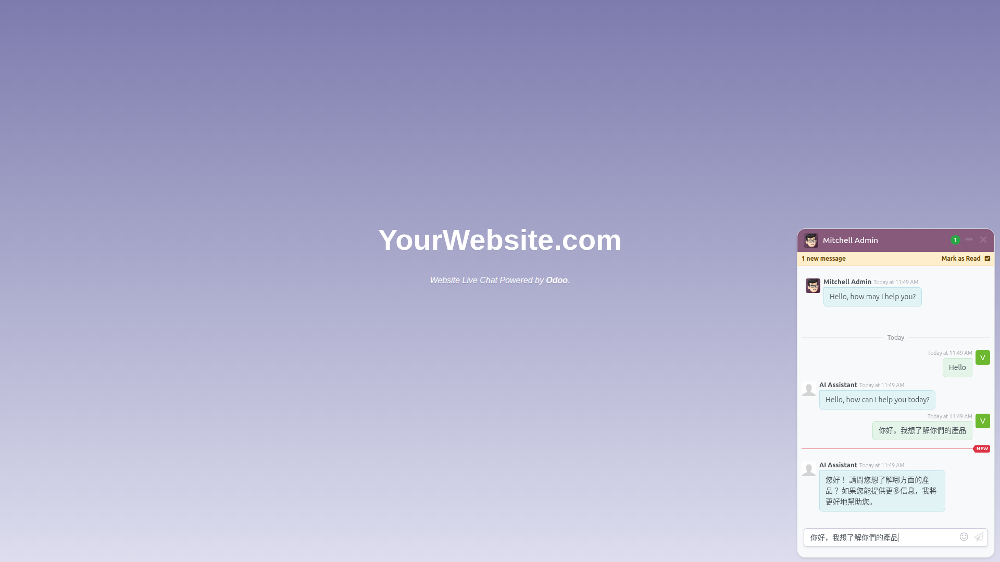
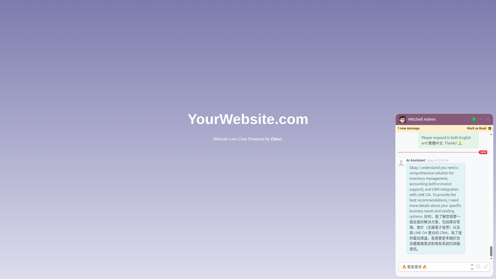

<p align="center">
  <h1 align="center">Live Chat AI Integration / 即時聊天 AI 整合</h1>
</p>

<p align="center">
  <strong><code>im_livechat_ai</code> -- Odoo 18 AI 智能客服模組</strong>
</p>

<p align="center">
  
  
  
  
  
  
</p>

<p align="center">
  將 Odoo 即時聊天與 OpenAI 相容 LLM API 整合，<br/>
  實現全自動 AI 智能客服回覆 -- 直接呼叫 API，無需任何外部工具。
</p>

<p align="center">
  <a href="README.md">English</a> &bull;
  <a href="#概述">概述</a> &bull;
  <a href="#為什麼使用此模組">為什麼使用</a> &bull;
  <a href="#架構">架構</a> &bull;
  <a href="#功能特色">功能特色</a> &bull;
  <a href="#截圖">截圖</a> &bull;
  <a href="#安裝">安裝</a> &bull;
  <a href="#設定">設定</a> &bull;
  <a href="#模組結構">模組結構</a> &bull;
  <a href="#安全性">安全性</a> &bull;
  <a href="#測試">測試</a> &bull;
  <a href="#疑難排解">疑難排解</a> &bull;
  <a href="#相依模組">相依模組</a> &bull;
  <a href="#更新日誌">更新日誌</a> &bull;
  <a href="#授權">授權</a>
</p>

---

## 概述

**im_livechat_ai** 是由 [WOOWTECH](https://github.com/WOOWTECH) 開發的 Odoo 18 模組，將 Odoo 即時聊天小工具與 OpenAI 相容的 LLM API 直接整合。它能在網站訪客發送訊息時，自動呼叫大型語言模型 API 生成智能回覆，實現全自動化的 AI 客服。

當訪客透過即時聊天小工具發送訊息時，模組會在背景執行緒中直接呼叫配置好的 LLM API（`/v1/chat/completions`），取得 AI 回覆後以「AI 助理」的身份在聊天對話中回覆訪客。整個過程完全在 Odoo 內部完成，無需任何外部協調工具。

---

## 為什麼使用此模組

| 沒有此模組 | 使用此模組 |
|---|---|
| 僅能手動回覆聊天 | 自動 AI 智能回覆 |
| 需要自行編寫 AI 整合程式碼 | 開箱即用，零後端 AI 程式碼 |
| 無 API 呼叫記錄 | 完整 API 呼叫記錄與 token 追蹤 |
| 單一語言支援 | 多語言 AI 回覆（取決於 LLM 能力） |
| 無重試邏輯 | 可設定重試次數與延遲 |
| 無迴圈防護 | 內建 AI 迴圈防護機制 |
| 無多輪對話 | 自動建構對話歷史上下文 |
| 需整合外部工具 | 直接 HTTP 呼叫，架構簡潔 |

---

## 架構

### ASCII 流程圖

```
                              Odoo 18
 +---------------------------------------------------------------------+
 |                                                                     |
 |  Website Visitor（網站訪客）                                          |
 |       |                                                             |
 |       v                                                             |
 |  Livechat Widget（即時聊天小工具）                                      |
 |       |                                                             |
 |       v                                                             |
 |  discuss.channel.message_post()                                     |
 |       |                                                             |
 |       v                                                             |
 |  _notify_thread() hook                                              |
 |       |                                                             |
 |       v                                                             |
 |  _should_trigger_ai_response()                                     |
 |       |  Is livechat? AI enabled? Visitor message?                  |
 |       |                                                             |
 |       v                                                             |
 |  _trigger_ai_response()                                            |
 |       |  Spawn daemon thread（建立背景執行緒）                          |
 |       |                                                             |
 |       v                                  +------------------------+ |
 |  _build_llm_messages()                   |   OpenAI-Compatible    | |
 |       |  Fetch recent history            |      LLM API           | |
 |       |  Strip HTML, decode entities     |                        | |
 |       |  Assign roles (user/assistant)   |  /v1/chat/completions  | |
 |       v                                  |                        | |
 |  _call_llm_api() ---- POST ------------>|  OpenAI / MiniMax /    | |
 |       |  (with retry logic)              |  DeepSeek / Ollama /   | |
 |       |                                  |  Claude proxy / etc.   | |
 |       |<----------- JSON response -------|                        | |
 |       v                                  +------------------------+ |
 |  _create_bot_message()                                              |
 |       |  XSS protection (Markup.escape)                             |
 |       |  Newline -> <br/> conversion                                |
 |       v                                                             |
 |  Visitor sees AI reply（訪客看到 AI 回覆）                             |
 |                                                                     |
 +---------------------------------------------------------------------+
```

### 時序圖



### 流程圖



---

## 功能特色

- **直接 LLM API 呼叫** -- 直接透過 HTTP POST 呼叫任何 OpenAI 相容的 `/v1/chat/completions` 端點，支援 OpenAI、MiniMax、DeepSeek、Ollama、Claude 相容代理等。
- **多輪對話上下文** -- 自動擷取最近的聊天歷史（可設定 1-200 則），建構完整的對話上下文傳送給 LLM。
- **非同步背景執行** -- AI API 呼叫在 daemon 執行緒中執行，不阻塞聊天操作，確保使用者體驗流暢。
- **執行緒安全** -- 所有 ORM 欄位值在主執行緒中擷取後再傳遞給背景執行緒，避免跨執行緒 cursor 存取問題。
- **每個頻道獨立設定** -- 每個即時聊天頻道擁有獨立的 API URL、API 金鑰、模型選擇、系統提示詞等設定。
- **每個頻道獨立機器人** -- 每個頻道可設定專屬的機器人合作夥伴和自訂顯示名稱。
- **可設定重試邏輯** -- API 呼叫失敗時自動重試（可設定 1-10 次），並在所有重試失敗後向訪客發送自訂錯誤訊息。
- **XSS 防護** -- 使用 `Markup.escape` 對 LLM 回覆進行 HTML 跳脫，防止跨站指令碼攻擊。
- **HTML 清理與實體解碼** -- 建構 LLM 上下文時，自動去除 HTML 標籤並解碼 HTML 實體，確保傳送乾淨的純文字。
- **API 呼叫記錄** -- 完整記錄每次 API 呼叫的狀態、請求/回應內容、token 用量、回應時間及錯誤資訊。
- **Token 用量追蹤** -- 記錄每次呼叫的 prompt tokens、completion tokens 和 total tokens。
- **30 天自動清理** -- 排程動作每日自動清除超過 30 天的 API 記錄，防止資料庫無限增長。
- **迴圈預防** -- 排除 AI 機器人合作夥伴、OdooBot 及擁有使用者帳號的合作夥伴，防止 AI 回覆觸發無限迴圈。
- **測試 AI 連線** -- 一鍵「測試 AI 連線」按鈕，即時驗證 API 設定是否正確。
- **查看 API 記錄** -- 一鍵「查看 API 記錄」按鈕，快速檢視該頻道的所有 API 呼叫記錄。
- **輸入驗證** -- API URL 格式驗證、參數範圍驗證、必填欄位檢查等完整的輸入驗證機制。
- **序列化失敗處理** -- 背景執行緒中的資料庫寫入支援序列化失敗重試（最多 3 次），確保並行安全。
- **55 項自動化測試** -- 涵蓋核心功能、頻道整合及端對端整合的全面測試覆蓋。

---

## 截圖

### 即時聊天頻道總覽

<p align="center"></p>

### AI 整合設定分頁

<p align="center"></p>

### 管理員 Discuss 檢視與 AI 對話

<p align="center"></p>

### 訪客端即時聊天小工具

<p align="center"></p>

### 測試結果

| 基本英文問候 | 中文 UTF-8 測試 | 綜合壓力測試 |
|:---:|:---:|:---:|
|  |  |  |

---

## 安裝

### 標準 Odoo 安裝

1. **複製模組**到您的 Odoo addons 目錄：

   ```bash
   cp -r im_livechat_ai /path/to/odoo/addons/
   ```

   或直接 clone 此儲存庫：

   ```bash
   cd /path/to/odoo/addons
   git clone https://github.com/WOOWTECH/Woow_odoo_ai_livechat.git
   ```

2. **更新應用程式列表**：
   - 前往 **應用程式** 選單。
   - 點擊 **更新應用程式列表**。

3. **安裝模組**：
   - 搜尋 **"Live Chat AI"** 或 **"即時聊天 AI"**。
   - 點擊 **安裝**。

### Docker / Podman 部署

專案提供了位於 `odoo-ailivechat/` 目錄下的 `docker-compose.yml`，可快速部署 Odoo 18 + PostgreSQL 16 環境。

#### 服務架構

| 服務 | 映像檔 | 內部埠 | 對外埠 | 用途 |
|------|--------|:---:|:---:|------|
| **db** | `postgres:16` | 5432 | -- | PostgreSQL 資料庫（含健康檢查） |
| **odoo** | `odoo:18.0` | 8069 | **9094** | Odoo 18 應用程式伺服器 |

#### 快速啟動

```bash
cd odoo-ailivechat/

# 使用 Docker Compose 啟動
docker compose up -d

# Odoo 將在 http://localhost:9094 上可用
```

#### 使用 Podman（rootless 模式）

```bash
cd odoo-ailivechat/

# 使用 Podman Compose 啟動
podman-compose up -d

# Odoo 將在 http://localhost:9094 上可用
```

#### 部署目錄結構

```
odoo-ailivechat/
├── docker-compose.yml          # 服務定義
├── config/
│   └── odoo.conf               # Odoo 設定檔
├── addons/
│   └── im_livechat_ai/         # 模組（自動掛載）
└── data/
    ├── postgres/               # PostgreSQL 資料（持久化）
    └── odoo/                   # Odoo 檔案儲存（持久化）
```

#### 關鍵設定說明

- **網路：** 所有服務共享 `odoo-ailivechat-network` 橋接網路，支援內部主機名稱解析。
- **資料持久化：** PostgreSQL 資料和 Odoo 檔案儲存皆以 bind volume 掛載，確保重啟後資料不遺失。
- **健康檢查：** PostgreSQL 容器包含健康檢查；Odoo 會等待資料庫就緒後才啟動。
- **自動掛載 Addons：** `addons/` 目錄掛載至容器內的 `/mnt/extra-addons`，放入的模組即刻可用。

---

## 設定

### 步驟說明

1. 前往 **網站 > 即時聊天 > 頻道**（Website > Live Chat > Channels）。
2. 選擇現有頻道或建立新頻道。
3. 開啟 **AI 整合** 分頁。
4. 勾選 **啟用 AI 整合**（Enable AI Integration）。
5. 填寫必要欄位（詳見下方欄位說明）。
6. 點擊 **測試 AI 連線** 驗證設定是否正確。

### 設定欄位一覽

| 欄位 | 類型 | 預設值 | 說明 |
|------|------|--------|------|
| `ai_enabled` | Boolean | `False` | 啟用/停用 AI 整合 |
| `ai_api_base_url` | Char | -- | API 基礎 URL（例如 `https://api.openai.com/v1`） |
| `ai_api_key` | Char | -- | LLM 服務的 API 金鑰 |
| `ai_model` | Char | -- | 模型名稱（例如 `gpt-4o`、`deepseek-chat`、`MiniMax-Text-01`） |
| `ai_system_prompt` | Text | -- | 系統提示詞，定義 AI 助理的角色與行為 |
| `ai_max_history` | Integer | `50` | 最大歷史訊息數，用於建構對話上下文（1-200） |
| `ai_temperature` | Float | `0.7` | 溫度參數，控制回覆的隨機性（0.0-2.0） |
| `ai_max_tokens` | Integer | `1024` | AI 回覆的最大 token 數 |
| `ai_max_retries` | Integer | `3` | API 呼叫失敗時的最大重試次數（1-10） |
| `ai_retry_delay` | Integer | `2` | 重試之間的延遲秒數（1-30） |
| `ai_error_message` | Text | *（內建預設訊息）* | 所有重試失敗後發送給訪客的錯誤訊息 |
| `ai_bot_partner_id` | Many2one | -- | 機器人合作夥伴（`res.partner`），作為 AI 訊息的作者 |
| `ai_bot_name` | Char | `AI Assistant` | 機器人在聊天中的顯示名稱 |

### 支援的 LLM 供應商

本模組支援任何 OpenAI 相容的 `/v1/chat/completions` API，包括但不限於：

| 供應商 | API Base URL 範例 | 模型範例 |
|--------|-------------------|----------|
| **OpenAI** | `https://api.openai.com/v1` | `gpt-4o`, `gpt-4o-mini` |
| **DeepSeek** | `https://api.deepseek.com/v1` | `deepseek-chat` |
| **MiniMax** | `https://api.minimax.chat/v1` | `MiniMax-Text-01` |
| **Ollama**（本地） | `http://localhost:11434/v1` | `llama3`, `mistral` |
| **Claude 相容代理** | *（視代理服務而定）* | `claude-3-opus`, `claude-3-sonnet` |
| **其他 OpenAI 相容 API** | *（視服務而定）* | *（視服務而定）* |

### UI 操作按鈕

- **測試 AI 連線** -- 發送測試請求至 LLM API，即時回報連線結果、模型資訊及 token 用量。
- **查看 API 記錄** -- 開啟篩選至當前頻道的 API 呼叫記錄視圖，預設顯示最近 7 天。

---

## 模組結構

```
im_livechat_ai/
├── __init__.py
├── __manifest__.py
├── models/
│   ├── __init__.py
│   ├── im_livechat_channel.py    # AI 設定欄位 + LLM API 呼叫邏輯
│   │                             #   - 13 個 AI 設定欄位
│   │                             #   - 輸入驗證約束
│   │                             #   - _trigger_ai_response() 非同步觸發
│   │                             #   - _process_ai_response() 背景處理
│   │                             #   - _call_llm_api() HTTP POST 呼叫
│   │                             #   - _create_bot_message() XSS 安全發送
│   │                             #   - _create_api_log() 記錄建立
│   │                             #   - _get_or_create_bot_partner() 機器人管理
│   │                             #   - action_test_ai_connection() 測試連線
│   │                             #   - action_view_api_logs() 檢視記錄
│   ├── discuss_channel.py        # 訊息攔截 + 對話上下文建構器
│   │                             #   - _notify_thread() 覆寫
│   │                             #   - _should_trigger_ai_response() 觸發判斷
│   │                             #   - _is_visitor_message() 迴圈防護
│   │                             #   - _build_llm_messages() 上下文建構
│   └── llm_api_log.py            # API 呼叫記錄模型
│                                 #   - 時間戳、狀態、token 用量
│                                 #   - 請求/回應 payload
│                                 #   - _cleanup_old_logs() 30 天清理
├── views/
│   ├── im_livechat_channel_views.xml  # AI 整合設定分頁
│   └── llm_api_log_views.xml          # API 記錄列表與表單視圖
├── data/
│   └── ai_data.xml               # AI 機器人合作夥伴 + 每日清理排程
├── security/
│   └── ir.model.access.csv       # 存取控制規則
├── tests/
│   ├── __init__.py
│   ├── test_im_livechat_ai.py    # 28 項核心單元測試
│   ├── test_discuss_channel.py   # 18 項頻道整合測試
│   └── test_integration.py       # 9 項端對端整合測試
└── i18n/
    └── zh_TW.po                  # 繁體中文翻譯
```

---

## 安全性

### XSS 防護

所有 LLM API 回覆在發送至聊天前，都會經過 `Markup.escape` 進行 HTML 跳脫處理，防止跨站指令碼攻擊。換行符號會被轉換為安全的 `<br/>` 標籤以保持格式。

### HTML 清理

建構 LLM 對話上下文時，歷史訊息的 HTML 標籤會被正規表達式去除，HTML 實體會被解碼為純文字，確保傳送給 LLM 的內容是乾淨的。

### 迴圈防護

`_is_visitor_message()` 方法確保只有真正的訪客訊息才會觸發 AI 回覆。以下作者會被排除：

- **頻道 AI 機器人合作夥伴**（`ai_bot_partner_id`）
- **預設 AI 機器人合作夥伴**（`im_livechat_ai.partner_ai_bot`）
- **OdooBot**（`base.partner_root`）
- 任何擁有**使用者帳號**的合作夥伴（`user_ids`）

### API 金鑰安全

API 金鑰作為 `Bearer` token 透過 `Authorization` 標頭傳送至 LLM 供應商。金鑰儲存在 Odoo 的 `im_livechat.channel` 記錄中，受 Odoo 標準存取控制保護。

### 輸入驗證

| 驗證項目 | 詳細說明 |
|----------|----------|
| API URL 格式 | 必須以 `http://` 或 `https://` 開頭 |
| 歷史訊息數 | 必須介於 1-200 之間 |
| 溫度參數 | 必須介於 0.0-2.0 之間 |
| 最大重試次數 | 必須介於 1-10 之間 |
| 重試延遲 | 必須介於 1-30 秒之間 |
| 必填欄位 | 啟用 AI 時，API URL、API Key、Model 為必填 |

### 最佳實踐

1. **使用 HTTPS** 作為 LLM API 的連線協定，保護 API 金鑰傳輸安全。
2. **定期輪換 API 金鑰**，降低金鑰洩漏風險。
3. **監控 API 記錄**，定期檢查失敗或異常的 API 呼叫。
4. **限制系統提示詞範圍**，避免 AI 回覆超出客服範疇。
5. **設定適當的 max_tokens**，控制回覆長度與 API 成本。

---

## 測試

### 測試套件總覽

本模組包含 **55 項自動化測試**，分布在 3 個測試套件中，提供從單元測試到端對端整合的全面覆蓋。

| 測試套件 | 檔案 | 測試數 | 說明 |
|----------|------|:---:|------|
| 核心單元測試 | `test_im_livechat_ai.py` | 28 | 頻道設定、API 呼叫邏輯、記錄清理、機器人管理 |
| 頻道整合測試 | `test_discuss_channel.py` | 18 | 訊息攔截、迴圈防護、對話上下文建構 |
| 端對端整合測試 | `test_integration.py` | 9 | 完整流程測試、重試邏輯、錯誤處理 |

### 執行測試

```bash
# 執行模組的所有測試
./odoo-bin -d your_db --test-enable --stop-after-init -i im_livechat_ai

# 執行特定測試標籤
./odoo-bin -d your_db --test-enable --stop-after-init --test-tags /im_livechat_ai

# Docker 環境中執行
docker exec -it odoo-ailivechat-web \
  odoo --test-enable --stop-after-init -d odooailivechat -i im_livechat_ai
```

### 測試覆蓋範圍

核心單元測試（28 項）涵蓋：

- AI 設定欄位的 CRUD 操作
- 輸入驗證約束（URL 格式、參數範圍）
- `_call_llm_api()` 請求建構與錯誤處理
- `_create_bot_message()` XSS 防護
- `_get_or_create_bot_partner()` 機器人合作夥伴管理
- `_create_api_log()` 記錄建立與 token 追蹤
- `action_test_ai_connection()` 連線測試
- `_cleanup_old_logs()` 30 天清理邏輯

頻道整合測試（18 項）涵蓋：

- `_notify_thread()` 訊息攔截機制
- `_should_trigger_ai_response()` 觸發條件判斷
- `_is_visitor_message()` 迴圈防護（機器人排除、OdooBot 排除、使用者帳號排除）
- `_build_llm_messages()` 對話上下文建構（角色指派、HTML 清理、歷史限制）

端對端整合測試（9 項）涵蓋：

- 完整的訪客訊息到 AI 回覆流程
- API 呼叫失敗後的重試邏輯
- 所有重試耗盡後的錯誤訊息發送
- 序列化失敗處理

---

## 疑難排解

### AI 沒有回覆

1. 確認頻道的 **啟用 AI 整合** 已勾選。
2. 確認 **API Base URL**、**API Key** 和 **Model** 三個必填欄位都已填寫。
3. 點擊 **測試 AI 連線** 按鈕，檢查連線是否正常。
4. 點擊 **查看 API 記錄**，查看是否有錯誤記錄。

### 連線測試失敗

1. 確認 API Base URL 格式正確（例如 `https://api.openai.com/v1`）。
2. 確認 API Key 有效且未過期。
3. 確認模型名稱拼寫正確。
4. 檢查 Odoo 伺服器是否能存取外部網路（防火牆、Proxy 設定）。

### 回覆品質不佳

1. 調整 **系統提示詞**，明確定義 AI 助理的角色、語言和行為規範。
2. 增加 **最大歷史訊息數**，提供更多對話上下文。
3. 調整 **溫度參數**：降低溫度（如 0.3）可獲得更確定性的回覆，提高溫度（如 1.0）可獲得更有創意的回覆。
4. 增加 **最大回應 token 數**，允許更長的回覆。
5. 嘗試不同的 LLM 模型。

### API 記錄顯示錯誤

1. 檢查 **Error Message** 欄位中的具體錯誤訊息。
2. 常見錯誤：
   - `401 Unauthorized` -- API 金鑰無效或已過期。
   - `429 Too Many Requests` -- 超過 API 速率限制，考慮增加重試延遲。
   - `500 Internal Server Error` -- LLM 供應商端問題，稍後重試。
   - `Connection Error` -- 網路連線問題。
   - `Timeout` -- API 回應超時（預設 60 秒），考慮減少 max_tokens 或使用更快的模型。

### Docker 相關問題

1. 確認所有容器正在執行：`docker compose ps`
2. 檢查容器日誌：`docker compose logs -f odoo`
3. 確認資料庫健康檢查通過：`docker compose logs db`

### Odoo 伺服器日誌

相關日誌可在 Odoo 伺服器日誌中搜尋以下關鍵字：

```
odoo.addons.im_livechat_ai
```

---

## 相依模組

| 模組 | 類型 | 用途 |
|------|------|------|
| `im_livechat` | Odoo 核心模組 | 提供即時聊天頻道模型（`im_livechat.channel`）和即時聊天小工具 |
| `mail` | Odoo 核心模組 | 提供 `discuss.channel`、`mail.message` 及訊息基礎架構 |

**Python 相依套件：**

| 套件 | 用途 |
|------|------|
| `requests` | HTTP POST 呼叫 LLM API（Odoo 內建） |
| `markupsafe` | XSS 防護的 HTML 跳脫處理（Odoo 內建） |

> 無需安裝額外的 Python 套件，所有相依套件皆包含在標準 Odoo 18 安裝中。

---

## 更新日誌

### v18.0.1.0.0（2026-04-11）

- 初始版本
- 直接 LLM API 整合（OpenAI 相容 `/v1/chat/completions`）
- 每個頻道獨立的 AI 設定（API URL、金鑰、模型、系統提示詞等）
- 多輪對話上下文建構（可設定歷史訊息數 1-200）
- 非同步 daemon 執行緒 API 呼叫，不阻塞聊天操作
- 可設定重試邏輯（1-10 次重試，1-30 秒延遲）
- AI 迴圈防護（排除機器人、OdooBot、內部使用者）
- XSS 防護（Markup.escape）
- API 呼叫記錄與 token 用量追蹤
- 30 天自動清理排程
- 每個頻道獨立機器人合作夥伴與自訂名稱
- 序列化失敗自動重試
- 一鍵測試 AI 連線
- 一鍵檢視 API 記錄
- 55 項自動化測試（28 核心 + 18 頻道 + 9 整合）
- Docker / Podman 部署設定
- 雙語文件（English + 繁體中文）
- 繁體中文翻譯（`i18n/zh_TW.po`）

---

## 授權

本模組採用 [GNU 較寬鬆通用公共授權條款 v3.0 (LGPL-3)](https://www.gnu.org/licenses/lgpl-3.0.html) 授權。

---

## 致謝

由 **[WOOWTECH](https://github.com/WOOWTECH)** 開發與維護。

<p align="center">
  <a href="https://github.com/WOOWTECH/Woow_odoo_ai_livechat/issues">Bug 回報與功能建議</a>
</p>

---

<p align="center"><sub>由 <a href="https://github.com/WOOWTECH">WOOWTECH</a> 精心打造 &bull; 基於 Odoo 18</sub></p>
